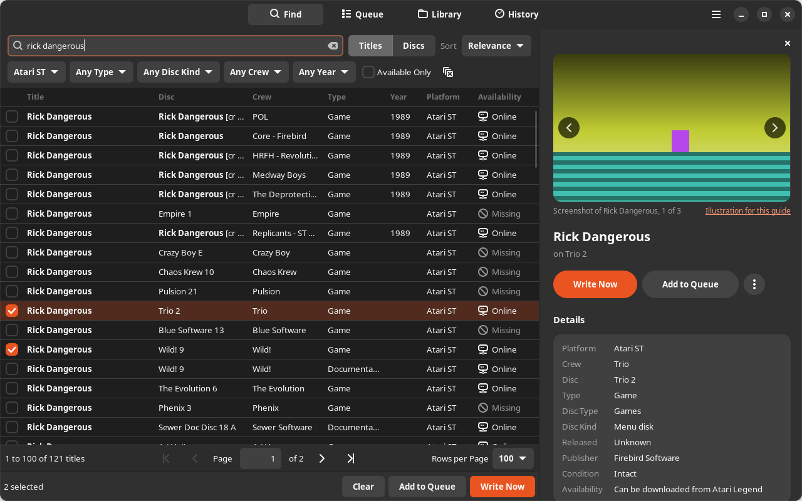
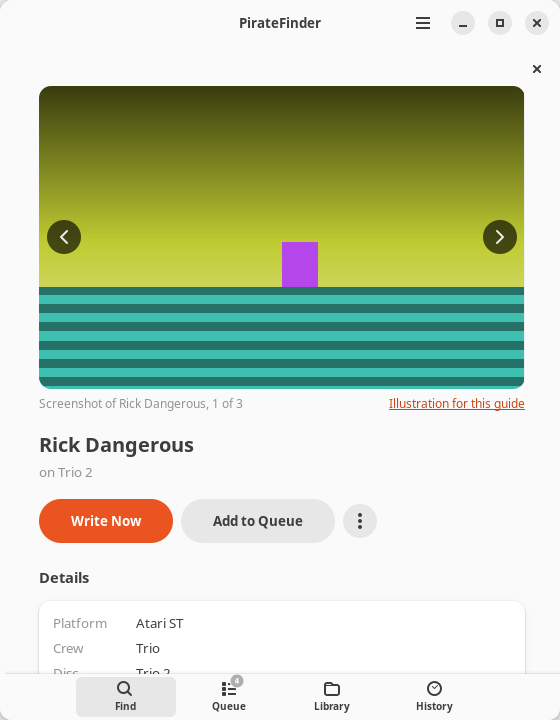
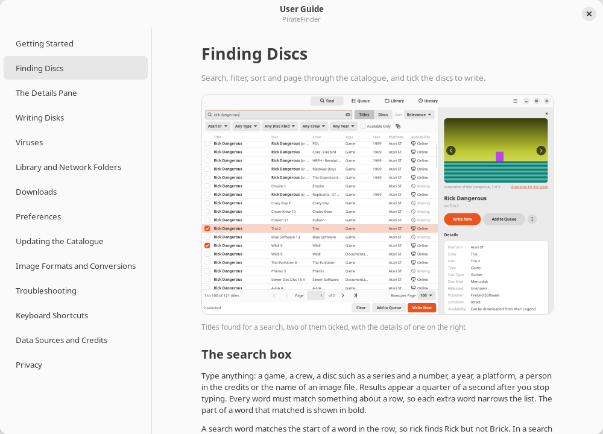

# PirateFinder

## menu disk finder

PirateFinder is a GNOME application for Linux that keeps a catalogue of about
61,800 Amiga and Atari ST disks: the numbered menu disks, compacts and packs
that crews such as Automation, Pompey Pirates, Medway Boys, D-Bug and Skid Row
released, together with single-game cracks. You search it for a game, a crew
or a disc number, filter and sort the results, and read what is on each disc
with pictures, facts, the crew's history and any virus warning. PirateFinder
then finds the images in your own or network folders, or downloads them from
third-party archives when you ask, and writes them to real floppies with a
Greaseweazle.


## Screenshots

The details pane, with a picture, the facts and the buttons that write the
disc:


A disc whose library copy carries a boot block virus. PirateFinder removes it
from the floppy it writes, and can clean the stored file:


Writing a queue of disks, and the summary at the end of the session:


The application follows the desktop's dark style:



In a narrow window the details cover the results and the page switcher moves to
the bottom:



The pictures in the details pane of these screenshots are drawn for the
documentation; the application shows real menu screens and screenshots from
the sources the catalogue names. Every screenshot in this repository is made
by `piratefinder.ui.screenshot` from the real window.

## Installing

### What you need

- Ubuntu 24.04, Linux Mint 22 or Debian 13, on amd64, arm64 or armhf, for the
  release packages. Other distributions can run PirateFinder from source; see
  [Installation](docs/INSTALLATION.md).
- A Greaseweazle and a floppy drive to write disks. Searching, browsing, the
  library and downloads work without them.

### From a GitHub release

Each release has a `.deb` package for each supported system and a
`SHA256SUMS` file. The package holds PirateFinder, the newest catalogue at the
time of the release, a private copy of the Greaseweazle host tools (1.23) and
the Greaseweazle device rule. Python, GTK 4 and libadwaita come from the
distribution.

The packages are named `PirateFinder_<version>_<distro>_<arch>.deb`. Take
`ubuntu-24.04` on Ubuntu 24.04 and Linux Mint 22, and `debian-13` on
Debian 13; `dpkg --print-architecture` prints the architecture. A package for
one release does not install on the other.
[Installation](docs/INSTALLATION.md#choosing-the-package) explains the choice.

Download the package and `SHA256SUMS` from the
[latest release](https://github.com/peteclarke-del/PirateFinder/releases/latest)
in a browser, or with `curl`; no GitHub account is needed:

```sh
distro=ubuntu-24.04
arch="$(dpkg --print-architecture)"
base=https://github.com/peteclarke-del/PirateFinder/releases/latest/download
curl -L -O "$base/SHA256SUMS"
package="$(grep -o "PirateFinder_[^ ]*_${distro}_${arch}\.deb" SHA256SUMS)"
curl -L -O "$base/$package"
sha256sum --check --ignore-missing SHA256SUMS
sudo apt install "./$package"
```

The GitHub command line tool downloads the same files with
`gh release download --repo peteclarke-del/PirateFinder --pattern "PirateFinder_*_${distro}_${arch}.deb" --pattern SHA256SUMS`;
`gh` itself asks you to sign in to a GitHub account of your own first.

Then unplug the Greaseweazle and plug it in again. The package installs a udev
rule that gives the logged-in user access to the device, and it applies only
when the device is connected again. Start **PirateFinder** from the
application grid, or run `piratefinder` in a terminal.

### Updating PirateFinder

Open **About PirateFinder** from the main menu and press **Check for
Application Updates**. PirateFinder asks GitHub for the latest release and
compares it with the version it shows. When a newer one is published,
**Update to** downloads the package made for your system, checks it against
the release's `SHA256SUMS`, installs it with apt after the system asks for your
password, and offers to restart PirateFinder. Your settings, library, queue
and history are kept. Nothing is checked until you press the button. A copy
run from the source tree is sent to the release page instead, and installing
the new package with `sudo apt install` as above works as well.

### Alongside Greaseweazle-GUI

PirateFinder installs its device rule as `49-piratefinder-greaseweazle.rules`,
and Greaseweazle-GUI installs the same rule as `49-greaseweazle.rules`, so the
two packages can be installed together. Each runs its own copy of the host
tools. Only one program can use the Greaseweazle at a time, so close
Greaseweazle-GUI, or let it finish, before writing from PirateFinder.

`sudo apt remove piratefinder` removes the application. Your settings,
library index, history and disk images are kept.
[Installation](docs/INSTALLATION.md) covers upgrading, removing, the files
PirateFinder keeps and folders on a NAS.

## A quick tour

1. On the Find page, type a game, a crew or a disc into the search box, such
   as `rick dangerous`, `a250` or `pp 51`, or choose a crew and a year from
   the filters. Tick the rows you want; ticks stay across pages and searches.
2. Select a row. The pane on the right shows pictures, the facts, every title
   on the disc, the crew, trivia, the known dumps and links, and warns about a
   virus on the dump that would be written.
3. Choose Write Now, or Add to Queue and later Start Writing on the Queue
   page. For each disc PirateFinder takes the image from your library or
   downloads it, prepares it, asks for a floppy, then writes and verifies it.
   The summary at the end lists every disc with its result.

The [User Guide](docs/USER_GUIDE.md) describes every part of the window. The
same guide opens in the application from the main menu, or with F1:



## Searching

Every word of a search must match something about a row: its title, disc,
series, crew, the people in its credits, platform, type, year, image file
names or notes. A word matches the start of a word, and the matching part is
shown in bold. A series name or one of its short names followed by a number
names a disc. Some searches that work on the current catalogue:

| Search | Finds |
| --- | --- |
| `a250`, `auto250`, `automation #250` | Automation 250 and Automation 250 v2 |
| `pp 51`, `pompey pirates menu disk 51` | Pompey Pirates 51 |
| `mb 60` | Medway Boys 60 |
| `sr 128` | Skid Row Compact 128 |
| `sgau 100` | SuperGAU 100 |
| `d-bug 100b`, `dbug 100 part b` | Part B of D-Bug 100 |
| `automation 100 v2` | The second version of Automation 100 |
| `automation necron 1990` | Necron on Automation 250 |
| `lemmings skid row` | Lemmings titles on Skid Row discs |
| `speedball quartex` | Speedball cracked by Quartex, listed in TOSEC as `[cr QTX]` |
| `xenon2` | Xenon 2 as well as Xenon2 |
| `turrican 2`, `turrican ii` | Turrican II and Turrican 2 alike |
| `battlehawks` | Battle Hawks 1942 as well as Battlehawks |
| `1800 msa` | Pompey Pirates 51, by the file name of its Atari Legend dump |

The short names come from `data/series/series.toml`; a correction or a new
alias there is a normal pull request.

## Filters, sorting and pages

- Titles lists one row for each game, demo or program on a disc, and Discs
  one row for each disc with up to six of its titles.
- The filters choose a platform, a type (Games, Applications, Demos or Music),
  a disc kind (Menu Disks, Packs, Single Disks or Compilations), a crew and a
  year, each with the number of discs it has. Available Only keeps discs that
  are in your library or can be downloaded.
- Results can be sorted by relevance, title, year, disc number, crew or
  platform, from the Sort list or the column headers.
- Results come 50, 100, 200 or 500 to a page, and Ctrl+Page Down and
  Ctrl+Page Up turn the page.


## The details pane

Selecting a row shows, from the top: pictures of the title and the disc with
their credits; the title, its disc and the Write Now and Add to Queue buttons;
a virus card when the dump carries a virus; the facts, with the release date
as precise as any source gives it and any boot block on the dump that is not a
virus; every title on the disc; the crew's history and members; trivia from
the catalogue's sources and Wikipedia summaries; every known dump, with a
choice of which to write; notes, credits, the menu's scroll text and reference
links. Menu texts and text drawn with symbols keep their layout in a
fixed-width font. Pictures and Wikipedia summaries are downloaded only when a
disc is shown, and not at all while Download Screenshots and Background
Information is off in Preferences.

Download All Pictures, in Preferences under Details Pane, fetches every picture
the catalogue lists for the Atari ST, the Amiga or both ahead of time, into the
same cache. It keeps to the pane's pace of one request a second to each site,
so all 78,000 or so pictures take about 12 hours and about 3 GB of space in
`~/.cache/piratefinder/media`; it carries on in the background, and the next
run starts from what is already there.

When the catalogue is wrong about a disc, Edit Details in the pane's menu
corrects its label, catalogue name, crew, release date (`YYYY`, `YYYY-MM` or
`YYYY-MM-DD`), publisher, cracker and notes, and the names of its titles. The
corrections live in your own user database, show in the results, the details
pane (marked Edited) and the crew folder of a download, and stay when the
catalogue is updated. The search, the filters and the sort orders use them
too: a disc is found and filtered by the crew, year and names you gave it.
Revert to Catalogue forgets them.


## Writing and the queue

- Write Now writes at once; Add to Queue keeps discs for a session later.
  The queue can be reordered, holds a number of copies for each disc, and is
  kept between runs.
- The drive is A or B for a PC cable (after or before the twist) or 0 to 3
  for a Shugart drive select, set on the Queue page or in Preferences.
- Before each disc an alert asks for a floppy: Write, Skip or Stop. A
  write-protected floppy or an empty drive brings it back with the reason.
- While writing, the page shows the track, retries and conversions. Each track
  is read back; a track that fails is written again up to the number of
  retries set in Preferences. Flux images (SCP and HFE) cannot be verified and
  are reported as written, not verified.
- The summary lists each disc's result and source, with the notes made on the
  way (a conversion, a virus removed, a download that could not be checked),
  and offers Retry Failed and Copy Report. Every session, with its notes, is
  kept on the History page and in the copied report.
- PirateFinder follows the Greaseweazle from the system's device list, which
  runs no program, and runs `gw info` only when a device is plugged in, or on
  Retry or Check Connection; never while writing. The Device setting names the
  port for writing and for that check.

PirateFinder runs the Greaseweazle host tool itself and reads its output as
well as its exit status, so a write-protected disk or an empty drive is
reported as such even when `gw` exits with status zero.

## Viruses

PirateFinder checks the boot block of every image it scans and every image it
prepares for writing:

- Amiga boot blocks are compared with the standard Kickstart 1.3 and 2.0 boot
  blocks. Any other is looked up first in the brainfile of Amiga Bootblock
  Reader, by Jason and Jordan Smith, when you have downloaded it (it has no
  licence that allows shipping it, so Preferences offers to download it from
  its GitHub release), then in the virus data built into PirateFinder: 34
  signatures of stretches of virus code, which recognise about 90 boot block
  viruses, then 25 checks from VirusX 4.0 and 58 from AntiCicloVir 2.4.
- Atari ST boot sectors are compared with built-in signatures of 8 boot
  sector virus families (Ghost, Signum/BPL, Kobold #2, Mad, OLI, C'T, Toubab
  and Blot/Swiss/FAT). A sector that carries the marker of one of 7 other
  viruses, from the Ultimate Virus Killer book, and code of the kind boot
  viruses use, is reported as probably infected and left unchanged.
  Immunisers and TOS boot loaders are left alone.
- A TOSEC `[v Name]` flag on a dump is shown too, because most flagged Amiga
  dumps carry file or link viruses outside the boot block.

When the virus data changes, with a new version of PirateFinder or a new
brainfile, PirateFinder checks the boot blocks of your library again, at
start or before the next scan. It reads only each boot block, so this is much
quicker than a scan.

For an identified boot block virus on an intact disk, Remove Before Writing
(on by default) gives the floppy a standard boot block without changing your
file, and Clean the Stored Image rewrites the file and keeps the original as a
`.bak`. When the catalogue knows a clean dump of the same disc, Use Clean Dump
chooses it. File and link viruses cannot be removed. Boot code PirateFinder
cannot identify is never changed, because many games and crews booted their
own loaders. The details pane shows such a boot block, and anti-virus and
loader boot blocks, as a plain fact.

## Library and NAS folders

Add the folders that hold your images on the Library page. Folders on a NAS
work while they are mounted, through GNOME Files or `/etc/fstab`. PirateFinder
reads plain images and the images inside zip, 7z, gzip and LZH files, with
one level of nesting, and rescans only files that changed. Each image is decoded
to raw sectors and matched to the catalogue by checksum, so an `.msa` matches
the TOSEC entry for the same `.st` disk whatever the file is called. Files
that match nothing stay searchable by file name, volume label and the names of
the files on the disk. Library folders are only read; the one exception is
Clean the Stored Image, after you confirm it.


## Downloads and the folder layout

Nothing is downloaded until you ask for a disc that is not in your library.
The providers in the current catalogue are the Internet Archive, Atari
Legend, the D-Bug search engine, exxos's Atari pages and the amigascne
archive, downloaded from its mirror on ftp.scene.org; each can be switched
off in Preferences, and so can online use as a whole. A download is checked
against the catalogue checksum before it is kept, and one that does not match
is deleted and the next provider tried. A file a source publishes without a
checksum of its own (the D-Bug and crew list MSAs, exxos zips, amigascne
files) is kept when it is a copy of any dump the catalogue lists for the
disc, and a note names that dump; it is kept unchecked only when the
catalogue knows no checksum for the disc at all. The HTTP client names
itself, sends at most one request a second to each host and backs off when a
server asks it to.

Downloads are kept in a folder you choose, which may be on a NAS, filed as
`<download folder>/<platform>/<type>/<crew>/<file>`:

```
Atari ST/Games/Automation/Automation Menu Disk 250 (1990)(Automation).st
Atari ST/Games/Empire/Speedball 2 - Brutal Deluxe (1990)(Image Works)[cr Empire][t].st
Amiga/Games/Skid Row/Compact #128 (1992)(Skid Row).adf
Amiga/Demos/Effect/Effect-PrevailPack147.adf
```

The type is Games, Applications, Demos or Music, from what is on the disc. The
crew is the crew behind the series, or for a single disc the crew that cracked
it, or its publisher.

## Preferences

| Page | Settings |
| --- | --- |
| General | Download folder, online downloads, pictures and background information, and one switch for each provider |
| Greaseweazle | Drive, device, retries, erase before writing, ask before each disk, a connection check, and IPF Support, which installs or removes the SPS Decoder Library |
| Catalogue | The installed catalogue, the update check at start, Update Now, and the Amiga Bootblock Reader brainfile |

The [User Guide](docs/USER_GUIDE.md#preferences) describes each setting and
its default.

## The catalogue

The catalogue is a read-only SQLite database built from public sources. The
build of 14 September 2026 holds:

| | Atari ST | Amiga |
| --- | --- | --- |
| Menu disks and compacts | 10,684 | 1,712 |
| Packs | 4,088 | 21,737 |
| Single disks | 8,769 | 14,463 |
| Compilations | 241 | 98 |

That is 61,792 discs in 1,395 series, with 117,611 titles listed on 42,818 of
them, 82,623 known dumps with their checksums, 225,888 download locations for
57,600 discs, 1,288 dumps that TOSEC flags with a virus, the addresses of
207,232 pictures, 20,811 facts, notes and Wikipedia article titles, and the
histories of 2,196 crews. It takes 329 MB installed and 88 MB compressed.

A new catalogue is built every week by a GitHub Actions workflow and published
as a release tagged `catalogue-YYYY-MM-DD`. PirateFinder can check for one at
start, and Update Catalogue installs it after checking its SHA-256 and its
layout; the library, queue and history are kept. The catalogue file in each
release is named by its layout, such as `catalogue-layout3.sqlite.gz`, and the
check reads the public release list and looks only for the layout this version
reads. A check that cannot reach GitHub says "Could not check for a newer
catalogue" and why.

To build a catalogue yourself, from the source tree:

```sh
PYTHONPATH=src:. python3 -m catalogue_builder
```

It needs Python 3.12 and nothing else, writes `build/catalogue.sqlite` and a
compressed copy with its checksum, and caches every download in
`~/.cache/piratefinder-build`, so a second build fetches only what changed.
`--list-sources`, `--only`, `--skip`, `--with`, `--offline` and `--input` choose
what it reads; [Catalogue](docs/CATALOGUE.md) explains the options and how
records are merged.

## Supported image formats

| Format | Written as |
| --- | --- |
| `.adf` | Amiga DD or HD, including 81 to 84 cylinder images |
| `.dms`, `.adz`, `.gz` | Decoded to ADF, then as ADF |
| `.st` | Geometry from the boot sector, including 82 and 83 cylinder and 11 sector disks |
| `.msa` | Decoded to ST, then as ST |
| `.stx` | Converted to ST when the image carries no protection, otherwise refused |
| `.ipf` | Written when the SPS Decoder Library is available: IPF Support in Preferences installs it on amd64 and armhf; otherwise refused |
| `.scp`, `.hfe` | Written as flux; Greaseweazle cannot verify these writes |
| Inside `.zip`, `.7z`, `.lzh` | The disk image inside is read, then as above |

Images with extra cylinders get a disk definition with their real cylinder
count, because `gw` writes only the cylinders its format names.
[Format support](docs/FORMAT_SUPPORT.md) explains each case.

## Data sources

The catalogue is built from the TOSEC DAT pack, Atari Legend's weekly database
export, the D-Bug search engine, Demozoo's daily export, the Steem Automation
list, the crew lists on the 1997 Pompey Pirates CD-R, the 8bitchip menu disk
index, exxos's Persistence of Vision pages, the amigascne archive's index and
menu texts (from its scene.org mirror), the Internet Archive,
libretro-thumbnails and Wikidata. The details pane shows pictures from Atari
Legend, D-Bug, Demozoo and libretro-thumbnails, and summaries from Wikipedia
under CC BY-SA 4.0, each with its credit. Sites that block automated clients,
such as Janeway, the English Amiga Board and Hall of Light, are not read.
[Data sources](docs/DATA_SOURCES.md) lists each source, what is taken from it,
its terms and how the builder limits its requests. The virus data built into
PirateFinder takes facts from AntiCicloVir 2.4 by Matthias Gutt (public
domain), VirusX 4.0 by Steve Tibbett and Dan James, and the numbers in the
Ultimate Virus Killer book by Richard Karsmakers; see
[Third-party notices](THIRD_PARTY_NOTICES.md).

## Privacy

PirateFinder has no account, telemetry or crash reporting, and searches run on
the local catalogue. It goes online to check for a newer catalogue at start
(which can be switched off), to check for and download a newer version of
PirateFinder when you press Check for Application Updates, to download a disc
you ask for, to fetch pictures
and Wikipedia summaries for the disc in the details pane (which can be
switched off), and to download the Amiga Bootblock Reader brainfile, or the
SPS Decoder Library for IPF images from fs-uae.net, when you ask. The
Greaseweazle host tool's `gw info`, which PirateFinder runs when a Greaseweazle
is plugged in and when you choose Retry or Check Connection, also asks GitHub
for the newest Greaseweazle firmware version, except while Online Downloads is
off, when PirateFinder keeps that request from leaving the computer; the
regular device check reads local files only.
[Privacy](docs/PRIVACY.md) lists every request and every file PirateFinder
stores.

## Copyright

The disks PirateFinder catalogues contain copyrighted software. PirateFinder
hosts no disk images. It downloads an image only when you ask for it, from
third-party archives that it does not operate. You are responsible for
complying with the law where you live.

## Troubleshooting

| Problem | First thing to try |
| --- | --- |
| No Greaseweazle found | Reconnect it after installing the package, so the device rule applies, and close any other program using it |
| Write-protected | Close the write-protect hole and choose Write again |
| No index, or no disk | Check the disk, the drive's power and cable, and the drive choice: A after the twist, B before it, 0 to 3 for a straight cable |
| Tracks that do not verify | Try another floppy, clean the heads, and use double-density floppies where you can |
| "Could not check for a newer catalogue" | No network, or GitHub is limiting requests; the message gives the reason. Try again later |

[Troubleshooting](docs/TROUBLESHOOTING.md) has the details and the commands to
check each one, and the Diagnostic Log in the main menu holds the Greaseweazle
output to copy into a report. [Support](SUPPORT.md) says what to include when
asking for help.

## Running from source

```sh
./piratefinder
```

The launcher adds `src` to `PYTHONPATH` and runs `python3 -m piratefinder`. It
needs Python 3.12 or newer, GTK 4, libadwaita 1.5 or newer and PyGObject
(`python3-gi`, `gir1.2-gtk-4.0` and `gir1.2-adw-1` on Debian and Ubuntu), `7z`
from the 7zip package for 7z and LZH archives, and the Greaseweazle host tools to write.
PirateFinder runs `PIRATEFINDER_GW` when it is set, otherwise the first `gw`
on `PATH`, otherwise the packaged copy in `/usr/lib/piratefinder/bin`. From a
source tree it reads `build/catalogue.sqlite`; set `PIRATEFINDER_CATALOGUE` to
use another file.

To try the interface without a catalogue or hardware, start it with the
simulated back end, which has a few invented discs:

```sh
PIRATEFINDER_FAKE_BACKEND=1 ./piratefinder
```

## Development

```sh
PYTHONPATH=src:. python3 -m unittest discover -s tests
ruff check src catalogue_builder tests
ruff format --check src catalogue_builder tests
```

The tests build synthetic disk images at run time; no real disk image is
stored in the repository. The window tests are skipped where PyGObject is not
installed; CI sets `PIRATEFINDER_REQUIRE_GTK` so they cannot be skipped
there. The CI workflow (`.github/workflows/ci.yml`) runs ruff 0.16.4, the
tests under Xvfb with Ubuntu 24.04's GTK and libadwaita, checks the
launchers and the desktop metadata, and builds and install-tests the Ubuntu
24.04 amd64 and Debian 13 arm64 packages. The Catalogue workflow builds
and publishes the weekly catalogue, and the Release workflow builds, installs
and publishes every package when a version tag is pushed.

The screenshots in `docs/images` and in the User Guide are drawn from the real
window with the simulated back end, searching a real catalogue when one is
given. The tool needs a display, which may be a Broadway display
(`gtk4-broadwayd`) where there is no desktop session; see
[Contributing](CONTRIBUTING.md):

```sh
PYTHONPATH=src:. python3 -m piratefinder.ui.screenshot --catalogue build/catalogue.sqlite
```

It writes each state in light and dark, copies the light pictures the User
Guide shows into `src/piratefinder/data/help`, and removes pictures the guide
no longer uses. The guide's text is in `src/piratefinder/ui/help_content.py`;
after changing it, run `PYTHONPATH=src python3 -m piratefinder.ui.help_content`
to write [docs/USER_GUIDE.md](docs/USER_GUIDE.md) again. A test fails when the
two differ.

[Contributing](CONTRIBUTING.md) has the full list of checks and the rules for
new catalogue sources.

## Documentation

- [User Guide](docs/USER_GUIDE.md): everything in the application, with
  screenshots; the same text as the in-app guide
- [Installation](docs/INSTALLATION.md): the package, the files PirateFinder
  keeps, NAS folders, upgrading and removing
- [Troubleshooting](docs/TROUBLESHOOTING.md)
- [Privacy](docs/PRIVACY.md): network requests and stored files
- [Format support](docs/FORMAT_SUPPORT.md): how each image format is prepared
  and written
- [Data sources](docs/DATA_SOURCES.md): every source, its terms and its
  request limits
- [Catalogue](docs/CATALOGUE.md): building and merging the catalogue, and how
  search works
- [Design](docs/DESIGN.md): how the parts fit together
- [Current status](docs/CURRENT_STATUS.md): what works and what does not yet
- [Release process](docs/RELEASING.md)
- [Documentation index](docs/README.md)
- [Roadmap](ROADMAP.md), [Contributing](CONTRIBUTING.md),
  [Support](SUPPORT.md), [Security](SECURITY.md),
  [Governance](GOVERNANCE.md) and [Code of conduct](CODE_OF_CONDUCT.md)
- [Third-party notices](THIRD_PARTY_NOTICES.md)

## Status and roadmap

Version 0.2.3 is the current release. Version 0.2.0 brought the paged Find
screen with its filters, the pictures, crew histories and trivia in the
details pane, virus detection and Check for Application Updates; 0.2.1 added
Download All Pictures, 0.2.2 asks again for pictures a busy site turned
away, and 0.2.3 finds titles under more spellings and locates thousands more
discs. No write to a real floppy has been tested yet: writing has been checked against the real
`gw` tool without a Greaseweazle attached. [Current status](docs/CURRENT_STATUS.md)
lists what works and what is unfinished, and the [Roadmap](ROADMAP.md) the
planned catalogue, library, writing and distribution work.

## Licence

The PirateFinder source code is licensed under GPL-3.0-or-later; see
[LICENSE](LICENSE). The catalogue data is licensed under CC BY-NC-SA 4.0,
because it includes Atari Legend data under that licence: it may be shared
and adapted for non-commercial purposes, with credit and under the same
licence. The bundled Greaseweazle host tools are released under the
Unlicense. See [NOTICE](NOTICE) and
[Third-party notices](THIRD_PARTY_NOTICES.md).
