<!-- Written by `python3 -m piratefinder.ui.help_content` from src/piratefinder/ui/help_content.py. Edit that file, not this one. -->

# PirateFinder User Guide

The same guide opens inside PirateFinder: choose User Guide in the main menu, or press F1. The pictures show the application with example data.

## Contents

- [Getting Started](#getting-started)
- [Finding Discs](#finding-discs)
- [The Details Pane](#the-details-pane)
- [Writing Disks](#writing-disks)
- [Viruses](#viruses)
- [Library and Network Folders](#library-and-network-folders)
- [Downloads](#downloads)
- [Preferences](#preferences)
- [Updating the Catalogue](#updating-the-catalogue)
- [Updating PirateFinder](#updating-piratefinder)
- [Image Formats and Conversions](#image-formats-and-conversions)
- [Troubleshooting](#troubleshooting)
- [Keyboard Shortcuts](#keyboard-shortcuts)
- [Data Sources and Credits](#data-sources-and-credits)
- [Privacy](#privacy)

## Getting Started

What PirateFinder does, how the window is laid out, and what to set up first.

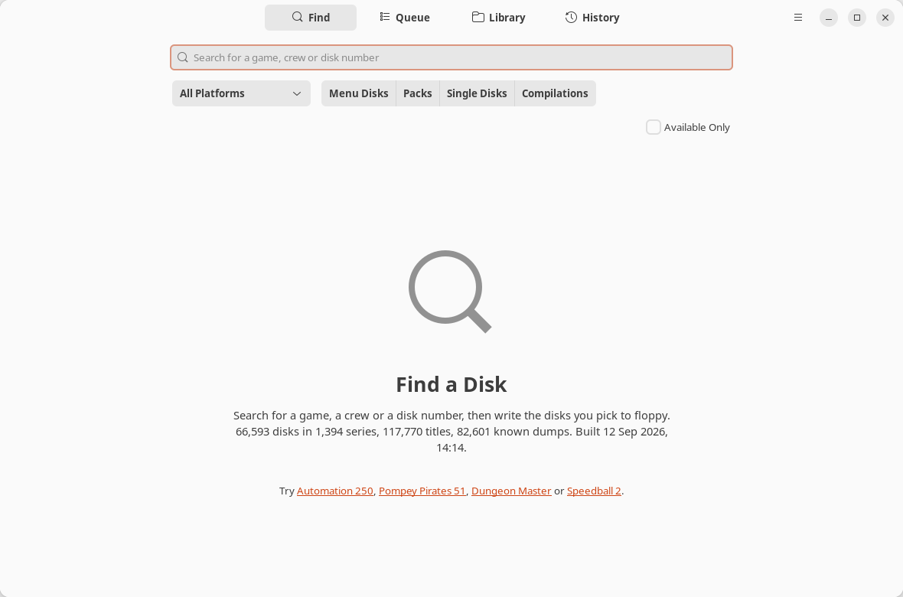

### What PirateFinder does

PirateFinder keeps a catalogue of the menu disks, compacts and packs that Amiga and Atari ST crews released, such as Automation, Pompey Pirates, Medway Boys, D-Bug and the Skid Row compacts, and of single cracked games. You search it for a game, a crew or a disc number, pick the discs you want, and PirateFinder writes them to real floppies with a Greaseweazle.

Images come from your own folders first. A disc that is not in them can be downloaded from the online providers you allow, and is then kept in your download folder, so it is local next time.

### The window

The switcher in the header bar has four pages.

| Page | What it is for |
| --- | --- |
| Find | Searches and browses the catalogue. The details of the selected title or disc open on the right. |
| Queue | Holds the discs waiting to be written and the drive to use. While writing it shows the progress, and at the end the summary. |
| Library | Lists the folders PirateFinder looks in, the download folder, the scan counts, files with a virus and files that match no disc. |
| History | Lists every past writing session with its summary. |

### The main menu

The main menu, at the right of the header bar, holds Preferences, Update Catalogue, Scan Library, Diagnostic Log, Keyboard Shortcuts, this User Guide and About PirateFinder. Alt+1 to Alt+4 switch between the pages. In a narrow window the page switcher moves to the bottom of the window.

### The first run

1. Look at the Find page. It says how many discs the catalogue holds and when it was built. If it says No Catalogue Installed instead, see Updating the Catalogue.
2. On the Library page, choose Add Folder for each folder that holds disk images. PirateFinder scans a folder as soon as it is added. Folders on a NAS work while they are mounted.
3. Choose a download folder on the Library page, or keep the default, Floppy Images/PirateFinder in your home folder.
4. Connect the Greaseweazle and the drive. In Preferences, on the Greaseweazle page, choose the drive that matches the cable and press Check Connection.
5. Search for a disc, select it, and choose Write Now.

### Connecting the Greaseweazle

PirateFinder writes with the Greaseweazle host tool, `gw`. The package brings its own copy and a device rule that gives the logged-in user access to the Greaseweazle. Unplug the Greaseweazle and plug it in again once after installing, so the rule applies.

PirateFinder watches the computer's list of USB devices every two seconds, which runs no program and uses no network. When a Greaseweazle appears it asks the host tool once which device it is. While none is found, a bar under the header says No Greaseweazle connected, with a Retry button. Searching, queueing and downloading still work; writing waits until the device answers. Nothing is checked while a disc is being written.

Check Connection in Preferences, on the Greaseweazle page, shows the model, port, firmware and host tool version of the device it finds. If nothing is found, see Troubleshooting.

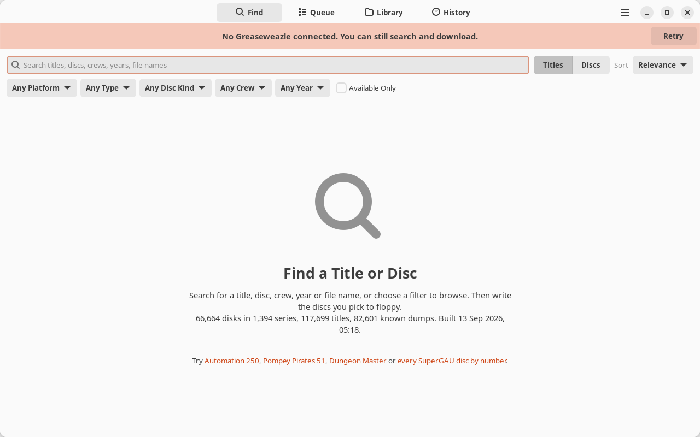

## Finding Discs

Search, filter, sort and page through the catalogue, and tick the discs to write.

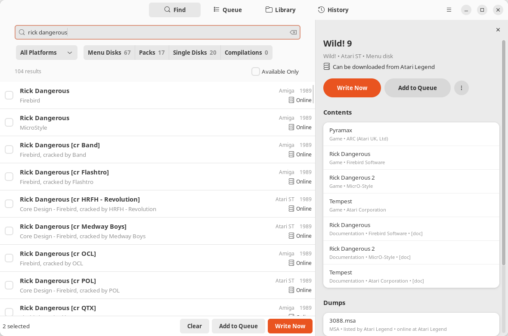

### The search box

Type anything: a game, a crew, a disc such as a series and a number, a year, a platform, a person in the credits or the name of an image file. Results appear a quarter of a second after you stop typing. Every word must match something about a row, so each extra word narrows the list. The part of a word that matched is shown in bold.

A search word matches the start of a word in the row, so rick finds Rick but not Brick. In a search of several words, the, a and an are ignored. When a search finds nothing, a word of three letters or more that starts no word in the catalogue is looked for inside titles and disc names instead.

A search that starts with a series name, or one of the short names people used for it, followed by a number names a disc. Some examples:

| Search | Finds |
| --- | --- |
| `a250`, `auto250`, `automation #250` | Automation 250, and its second version, Automation 250 v2. |
| `pp 51`, `pompey pirates menu disk 51` | Pompey Pirates 51. Words such as menu, disk, compact and pack may come between the name and the number. |
| `mb 60` | Medway Boys 60. |
| `sr 128` | Skid Row Compact 128. |
| `sgau 100` | SuperGAU 100. |
| `d-bug 100b`, `dbug 100 part b` | Part B of D-Bug 100. |
| `automation 100 v2` | The second version of Automation 100. |
| `automation necron 1990` | Necron on Automation 250. Without a number after the series, every word is matched as text. |
| `lemmings skid row` | Lemmings titles on discs from Skid Row. |
| `speedball quartex` | Speedball cracked by Quartex, whose TOSEC name says [cr QTX]. Crew tags are searched under the crew's full name too. |
| `xenon2` | Xenon 2 as well as Xenon2. |
| `turrican 2`, `turrican ii` | Turrican II and Turrican 2 alike: a sequel's number is found in either numerals. |
| `battlehawks` | Battle Hawks 1942 as well as Battlehawks. |
| `dungeon master 1988` | Dungeon Master rows that mention 1988, which is usually the year of release. |
| `1800 msa` | Pompey Pirates 51, whose Atari Legend dump is called 1800.msa. Image file names are searched as well. |

### Keys in the search box

Enter opens the first result. Escape clears the search box. Ctrl+F puts the cursor in the search box from anywhere in the window.

### Browsing without a search

You do not have to type anything. With the search box empty, choose a filter and every matching row is listed, in disc order unless you choose another sort. When the Find page opens it offers a few searches to start from, the last of them every disc of the largest menu crew in the catalogue.

### Titles and Discs

The two buttons beside the search box decide what a row is. Titles lists one row for each game, demo or program on a disc, so a game that is on three menu disks has three rows; a disc that lists no titles has one row of its own. Discs lists one row for each disc, with up to six of its titles, the matching ones in bold, or the publisher and cracker of a single-game disc.

| Column | Shows |
| --- | --- |
| Title | The game, demo or program. Titles only. |
| Disc | The disc label, such as Automation 250 or D-Bug 100 B. |
| Contents | Up to six titles on the disc. Discs only. |
| Crew | The crew behind the series. For a single disc, the crew that cracked it, or its publisher when it was never cracked. |
| Type | In Titles, what the title is: Game, Demo, Intro, Utility, Music, Documentation, Cheat or Trainer. In Discs, the disc's type: Games, Applications, Demos or Music. |
| Year | The year of release, when a source gives one. |
| Platform | Amiga or Atari ST. |
| Availability | Local when an image is in your library, Online when a provider you have switched on has one, and Missing otherwise. |

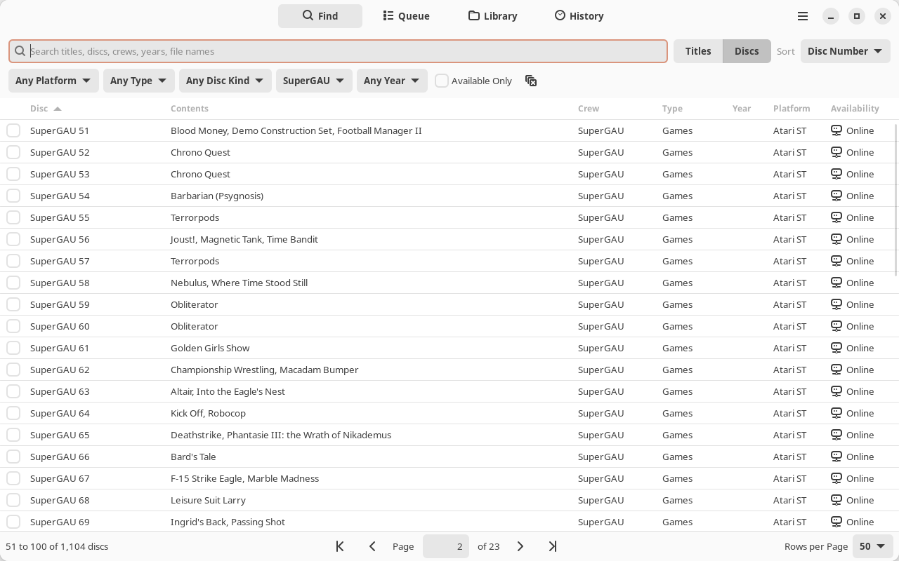

### Warning signs and narrow windows

A red warning sign at the end of a row marks a disc whose dump carries a known virus; hold the pointer over it to see the name, and see Viruses. In a narrow window the Type column is hidden first, then Platform, Crew and Availability.

### Filters

The row under the search box holds the filters. Each one narrows the list further, and in a narrow window they wrap onto a second line.

| Filter | Keeps |
| --- | --- |
| Platform | Amiga or Atari ST discs. |
| Type | Games, Applications, Demos or Music, decided by what is on the disc. The list shows how many discs have each type. |
| Disc Kind | Menu Disks (numbered crew menus and game compacts), Packs (demo, music, utility and trainer packs), Single Disks (one release on a disk, usually a single crack) or Compilations. |
| Crew | One crew. The list shows how many discs each crew has. Type while the list is open to find a crew by any part of its name. |
| Year | Discs from one year, with how many discs each year has. |
| Available Only | Discs in your library, or that a provider you have switched on can supply. |

### Clearing the filters

The Clear Filters button at the end of the row appears while any filter is on, and puts them all back. When nothing matches, the No Results page says whether filters are on and offers Clear Filters as well.

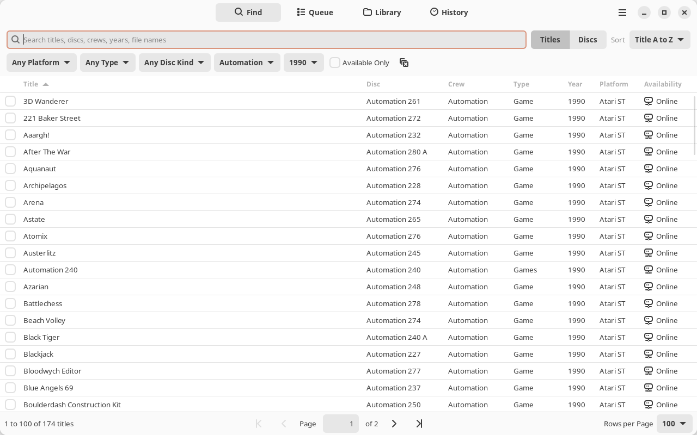

### Sorting and column headers

The Sort list beside the search box has these orders.

| Order | How rows are ordered |
| --- | --- |
| Relevance | A disc the search names comes first, then titles that are exactly the search, then titles that start with it, then the rest by how well they match. With no search text, the same as Disc Number. |
| Title A to Z, Title Z to A | By title. A leading The, A or An is passed over, and numbers go in order of value, so Disk 9 comes before Disk 10. |
| Year, Oldest First and Year, Newest First | By year of release, then title. Discs without a year come last. |
| Disc Number | Series by series, in order of number, part and version. |
| Crew | By crew, then in disc number order. |
| Platform | Amiga first, then Atari ST, each by title. |

The Title, Disc, Crew, Year and Platform column headers sort as well. A second click on Title or Year reverses the order; a second click on Disc, Crew or Platform goes back to Relevance. The headers and the Sort list always show the same order.

### Pages

Results come a page at a time. The bar under the table says which rows are shown, such as 101 to 200 of 1,234 titles, and has buttons for the first, previous, next and last pages. Type a page number and press Enter to go straight to it. Rows per Page offers 50, 100, 200 or 500 rows, 100 to start with. Ctrl+Page Down and Ctrl+Page Up turn the page from the keyboard.

### Ticking discs to write

Tick the box at the start of a row, or select the row and press Space. A tick stays when you turn the page, change the sort or the filters, or search for something else, so a set of discs can be put together from several searches. The bar at the bottom counts the ticks, for example 3 titles selected on 2 discs across 2 pages, and offers Clear, Add to Queue and Write Now.

Ticked titles on the same disc make one queue entry for that disc, written from its best dump. Add to Queue keeps the discs for a writing session later. Write Now starts writing them at once, without adding them to the queue. Ctrl+Plus and Ctrl+Enter do the same from the keyboard, and act on the disc in the details pane when nothing is ticked.

### Files that match no disc

Images in your library that match no catalogue disc are searched by file name, volume label and the names of the files on the disk. After a search with text, a bar above the results says how many such files match it. Show Files lists them. Choose one to see its location, archive member, volume label, any virus, its checksums and the files on it in the details pane, or use Add to Queue beside it.

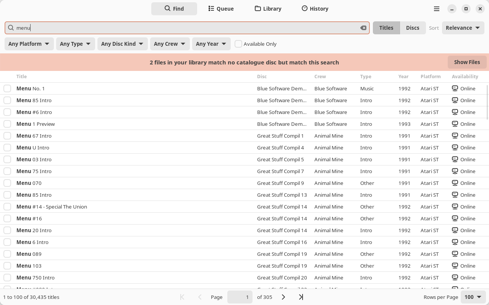

## The Details Pane

Pictures, facts, the other titles on the disc, the crew, trivia, dumps and links.

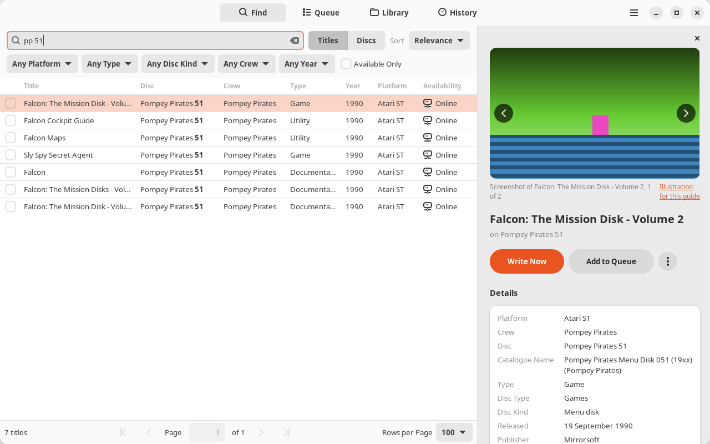

### Opening and closing

Select a row to open its details on the right, and use the cross at the top of the pane to close them. Another title of the same disc is shown at once; another disc is loaded first. Drag the left edge of the pane to make it wider or narrower, between 300 and 720 pixels. In a window narrower than about 900 pixels the pane lies over the results, and in a very narrow window it covers the whole width.

### Pictures

At the top are pictures of the selected title, then of its disc: menu screens, title screens, screenshots and box art. The arrows step through them. The caption says what the picture shows, such as Menu screen of Automation 250, 1 of 3, and the credit beside it names the source and links to its page.

Each picture is downloaded the first time it is shown and kept in a cache, so it appears at once next time. A picture narrower than 800 pixels, which includes every 320 by 200 screen of the time, is enlarged with square pixels rather than blurred.

### The heading and buttons

Under the pictures are the title and its disc, or the disc label with its series, date, platform and kind. A warning line appears when the catalogue lists the disc as damaged, intro only or missing.

| Button | What it does |
| --- | --- |
| Write Now | Writes the disc straight away. It is greyed out when no image of the disc is in your library or online. |
| Add to Queue | Adds the disc to the queue for a later session. |
| Download Only | In the menu beside the buttons. Downloads the disc into your download folder without writing it, with a progress bar and a Cancel button. When there is something to know about the download, such as that no checksum was known to check it against, an alert says so. |
| Show in Files | Opens the folder that holds your copy of the disc. |
| Copy Label Text | Copies a short line for a floppy label, such as Automation 250: Necron, Boulderdash Construction Kit. |
| Edit Details | In the same menu. Opens a form to correct the disc's details and the names of its titles; see Correcting the details below. |
| Revert to Catalogue | In the same menu, once you have corrected the disc. Forgets your corrections, after asking, so the catalogue's values show again. |

### Details

The Details card lists what the catalogue knows: platform, crew, disc, the catalogue's name for it, the title's type and the disc's type, disc kind, release date, publisher, cracker, the title's version and extras, the disc's condition, and where an image can be found.

Boot Block appears when the boot block of the dump that would be written holds something other than standard boot code that is not a virus: an anti-virus or immuniser, a named loader or intro, or boot code nobody has identified. It is shown for information only; a virus has its own red card instead. For a file that matches no disc, Boot Block appears once the file has been read.

The release date is as precise as any source gives it, to the day when that is known, such as 19 September 1990, and Unknown when no source gives one. Other facts the catalogue does not have are left out.

### On This Disc

Every title on the disc, in menu order, with its kind, cracker, publisher, version and extras. A tick marks the title shown above. Choose another title to show its pictures, facts and trivia; its row in the results is selected too when it is on the current page.

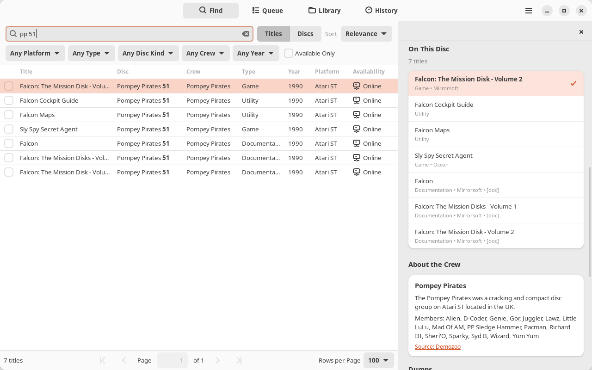

### About the Crew

The crew's history, founding date and members, when the catalogue has any, with links to the source and to the crew's Wikipedia article.

### Trivia

Facts and notes about the title and the disc from the catalogue's sources, each with its source and licence. Under them come summaries of the Wikipedia articles about the title, the disc and the crew. These are fetched in the background while the pane is open, with Looking up background information shown meanwhile, and are credited under CC BY-SA 4.0, the licence of Wikipedia text.

A note laid out like a menu screen, or drawn with symbols, is shown in a fixed-width font with its lines kept, and scrolls sideways when it is wider than the pane.

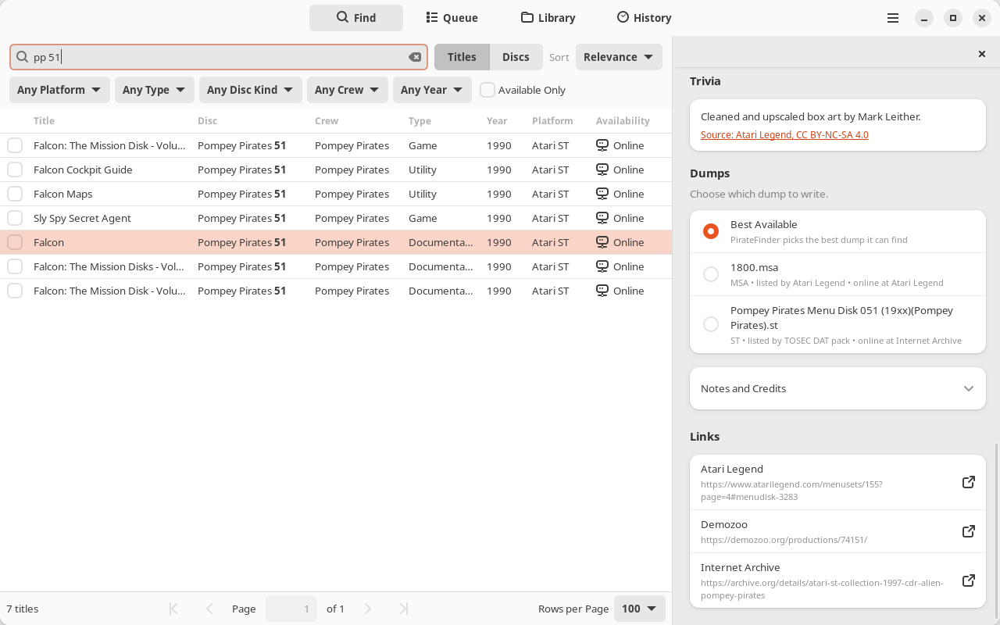

### Dumps

Every known dump of the disc, with its format, its TOSEC flags, the source that lists it, any virus, and where it is: in your library, with the path, or online at a provider. A warning icon marks a dump with a virus.

When there is more than one dump, the round buttons choose which one is written. Best Available, the default, lets PirateFinder choose: a good dump in your library first, then a download from a provider you have switched on, preferring formats Greaseweazle can write and dumps without a virus.

### Notes and Credits, Scroll Text and Links

Notes and Credits opens to show the catalogue's notes about the disc and the credits from its menu. Scroll Text opens to show the message the menu scrolls across the screen, as a source captured it, in a fixed-width font. Links opens reference pages, such as the disc's entry on Atari Legend, Demozoo or the Internet Archive, in your web browser.

### Correcting the details

When the catalogue is wrong about a disc, choose Edit Details in the menu beside the buttons. The form holds the disc's label, its catalogue name, crew, release date, publisher, cracker and notes, and the name of every title on the disc. Enter the release date as a year (1990), a year and a month (1990-06) or a whole date (1990-06-21). Save stays greyed out, with a line that says why, until the date has one of these forms and the label and every title have a name.

Your corrections are kept in your own user database, never in the catalogue file. They take the place of the catalogue's values in the results, in the details pane and in the name of the crew folder a download is filed in. They stay when the catalogue is updated: PirateFinder finds each corrected disc again in the new catalogue by its series and number, or by the checksums of its dumps. A value you corrected has a small Edited note beside it; hold the pointer over the note to see the catalogue's value.

The search, the filters and the sort orders use your corrections too. A disc whose crew or year you corrected is listed under the corrected crew or year in the Crew and Year filters, with the counts beside them, and a title you renamed is found by its new name and sorted by it. A search for the catalogue's old name still finds the row, but that name is not shown in bold, since the row no longer shows it.

Revert to Catalogue, in the form or in the menu, forgets every correction of the disc. Entering the catalogue's value in a field again forgets that one correction.

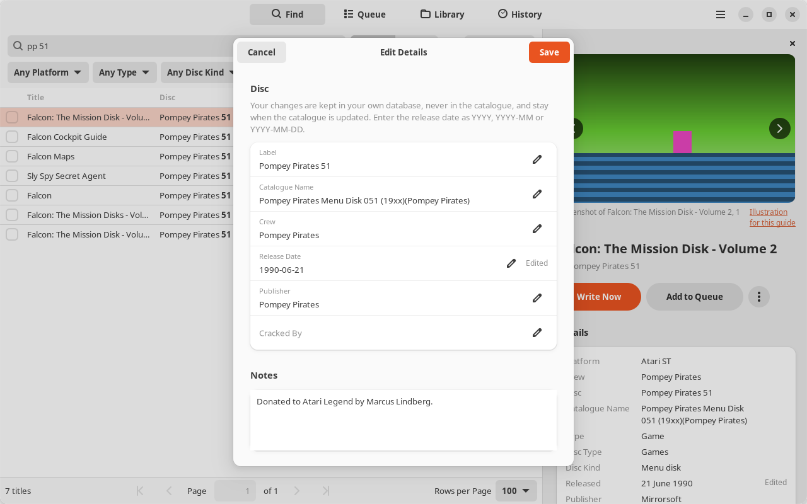

### Turning pictures off

Pictures and Wikipedia summaries are downloaded only while Download Screenshots and Background Information and Online Downloads are both on in Preferences. With either one off, the picture area says Pictures Are Off and offers Open Preferences, and no picture or summary is requested. Facts, notes and crew histories come with the catalogue and are still shown.

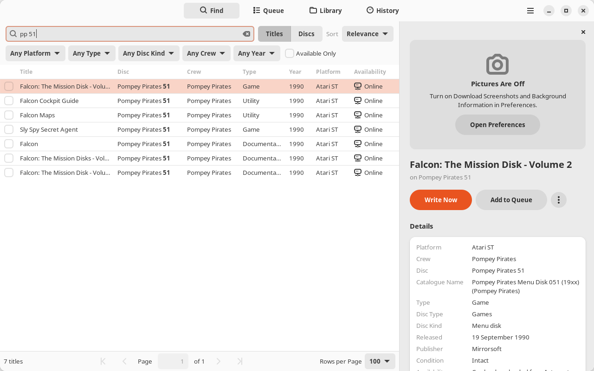

### Downloading every picture

The details pane fetches a disc's pictures when it first shows the disc. To have them all at once, for example before going offline, use Download All Pictures in Preferences, under Details Pane. Choose Atari ST and Amiga, Atari ST or Amiga, then Download. The row says how many of the pictures are already on this computer, and how long the rest take.

Pictures are fetched one a second from each site, as the details pane fetches them, so every picture the catalogue lists, about 78,000, takes about 12 hours, most of it for Demozoo's, and about 3 GB of space, most of it for libretro-thumbnails' full-size screens. Once some of each site's pictures are cached, the row also estimates the space the rest will take. They go into the same cache folder and are refreshed the same way. The download carries on with Preferences closed, Stop ends it, and closing PirateFinder stops it too. The next Download carries on from the pictures already there and asks nothing of a site for them. When a site misses several pictures in a row, PirateFinder rests before asking it for more, longer each time, and every picture missed is asked for once more at the end; one missed both times is counted as no longer on its site.

## Writing Disks

Write one disc now or several in a session, and what the prompts, progress and summary mean.

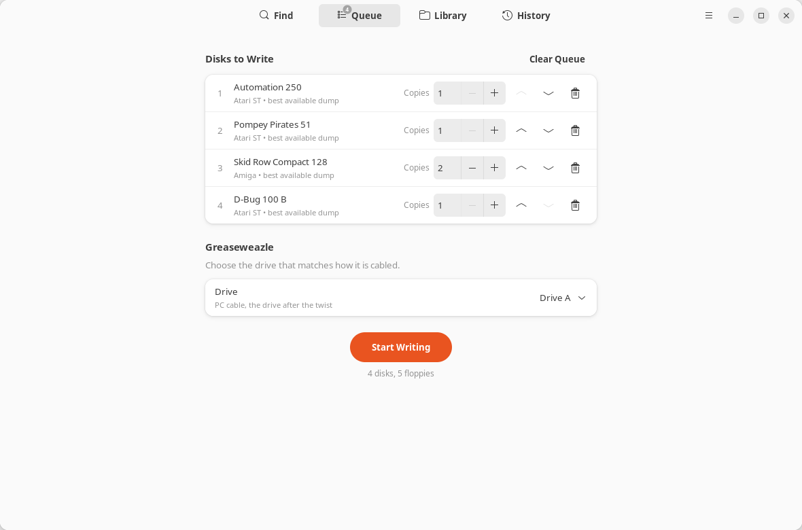

### Write Now or the queue

Write Now, in the details pane or in the bar under ticked rows, writes at once: PirateFinder opens the Queue page and starts a session with just those discs, without adding them to the queue. Add to Queue keeps discs on the Queue page until you choose Start Writing. The number on the Queue tab counts the discs waiting.

A disc, or a file from your library, is queued only once. Adding it again says that it is already in the queue.

### The queue

Each row shows the disc, its platform, and whether its best available dump, a dump you chose or a particular library file will be written. Beside it are the number of copies to write, from 1 to 20, buttons that move it up or down, and one that takes it off the queue. Clear Queue empties the queue after asking. The queue is kept when PirateFinder closes.

### Choosing the drive

Set the drive on the Queue page or in Preferences; both change the same setting. It must match how the drive is cabled to the Greaseweazle.

| Drive | Use it for |
| --- | --- |
| Drive A | A PC floppy cable, with the drive after the twist, at the end of the cable. This is the default, and the usual choice for one PC drive. |
| Drive B | A PC floppy cable, with the drive before the twist, on the middle connector. |
| Drive 0 to Drive 3 | A cable without a twist (a Shugart bus), with the drive jumpered for drive select 0, 1, 2 or 3. |

### A writing session

1. Choose Start Writing on the Queue page, or Write Now. PirateFinder first makes sure a Greaseweazle has been found; when none has, it says so and offers Check Again, which asks the host tool.
2. For each disc it finds an image: a library file first, otherwise a download from a provider you have switched on, which is checked and kept in the download folder. It then prepares the image for writing, converting it where needed.
3. It asks for a floppy. Insert a blank or unwanted floppy with its write-protect hole closed, and choose Write. Everything on the floppy is overwritten.
4. Choose Skip to leave that disc out, or Stop to end the session. Discs that were not written stay in the queue.
5. When the last disc is done, the summary appears.

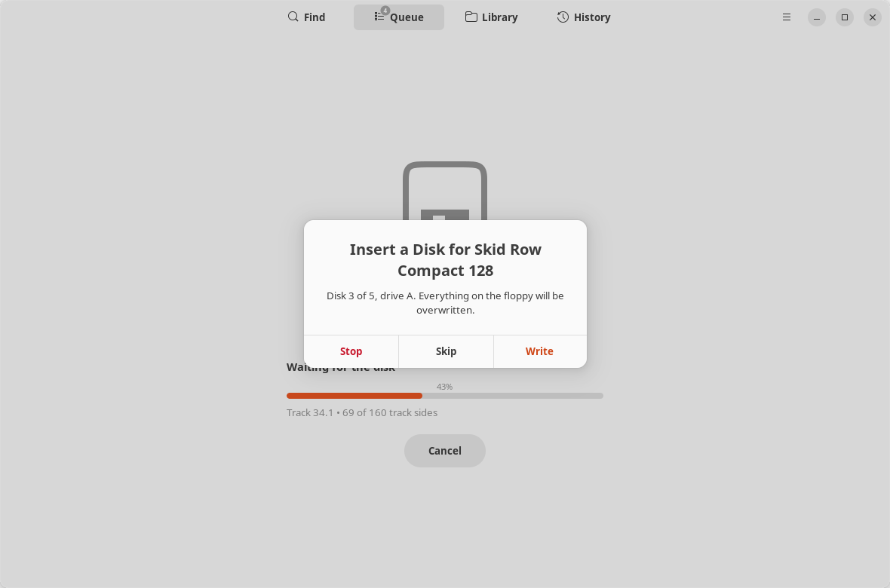

### The insert prompt

The prompt names the disc, its place in the session and the drive, such as Disk 3 of 5, drive A. With Ask Before Each Disk switched off in Preferences, only the first disc of a session is asked for and the rest follow straight on, so have the floppies ready. A write-protected floppy or an empty drive brings the prompt back with the reason, so you can put it right and choose Write again.

While one disc is written, the next one is downloaded in the background when it is only available online, so the session does not wait for it.

### Progress

While a disc is written, the Queue page shows which disc of how many, what is happening (finding the image, downloading, preparing or writing), a progress bar, the track being written, such as Track 34.1, 69 of 160 track sides, the retries so far on this disc, and notes about conversions, such as Unpacked the MSA archive to a plain sector image.

Cancel asks before it stops. The floppy being written is left incomplete, and discs not yet written stay in the queue. Closing the window while writing asks the same question.

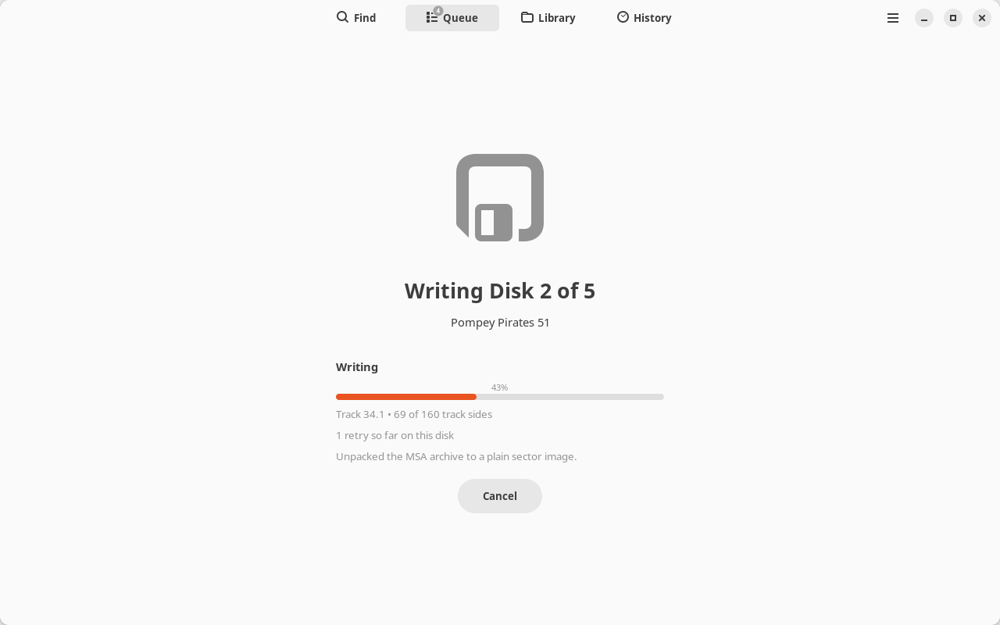

### Retries and verification

Greaseweazle reads each track back after writing it. A track that does not read back correctly is written again, up to the number of Retries set in Preferences, 3 to start with. A track that still fails makes the disc Failed, and the summary lists the tracks. Erase Before Writing, in Preferences, wipes each track first; it is slower and can help with old floppies.

Flux images (SCP and HFE) are written as they are. Greaseweazle cannot read back and compare a flux write, so those discs are reported as Written, not verified.

### The summary

At the end of a session the summary lists every disc and copy with its result, the retries, any failed tracks, where the image came from, and the notes made on the way: a conversion such as Unpacked the MSA archive to a plain sector image, a virus removed or left in place, or a download that could not be checked.

| Result | Meaning |
| --- | --- |
| Written and verified | Every track was written and read back correctly. |
| Written, not verified | The floppy was written, but Greaseweazle could not check it, as with a flux image. |
| Failed | A track did not verify after the retries, or Greaseweazle reported an error. The reason is given. |
| Disk is write-protected | The write-protect hole was open. |
| No disk in the drive | Greaseweazle found no index pulse, or could not find track 0. |
| Cancelled | Writing was stopped. The floppy is incomplete. |
| Skipped | You chose Skip, or the session was stopped before this disc. |
| No usable image | No image could be found, downloaded or prepared. The reason is given. |

### After a session

Retry Failed writes the discs that failed again, in a new session. Copy Report copies the summary as text, with the notes. Done goes back to the queue. Discs from the queue that were written are taken off it; the others stay for another try.

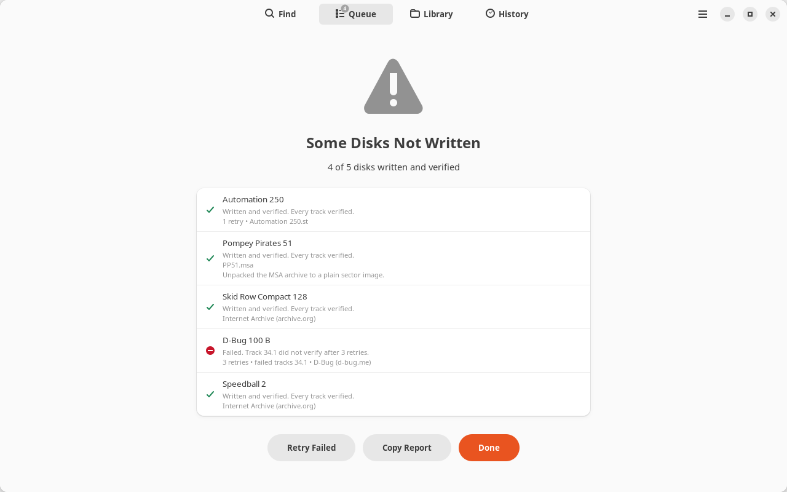

### History

The History page lists past sessions, the most recent 200 of them, newest first, with the date and time, how many discs were written and the drive used. Open one to see the result of each disc with its notes, or copy its report with the button beside it.

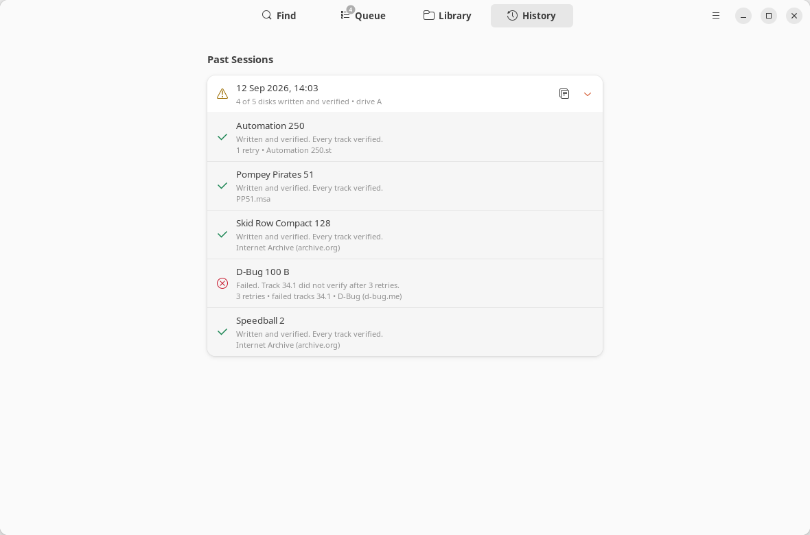

## Viruses

How PirateFinder finds boot block viruses and virus-flagged dumps, and what it can do about them.

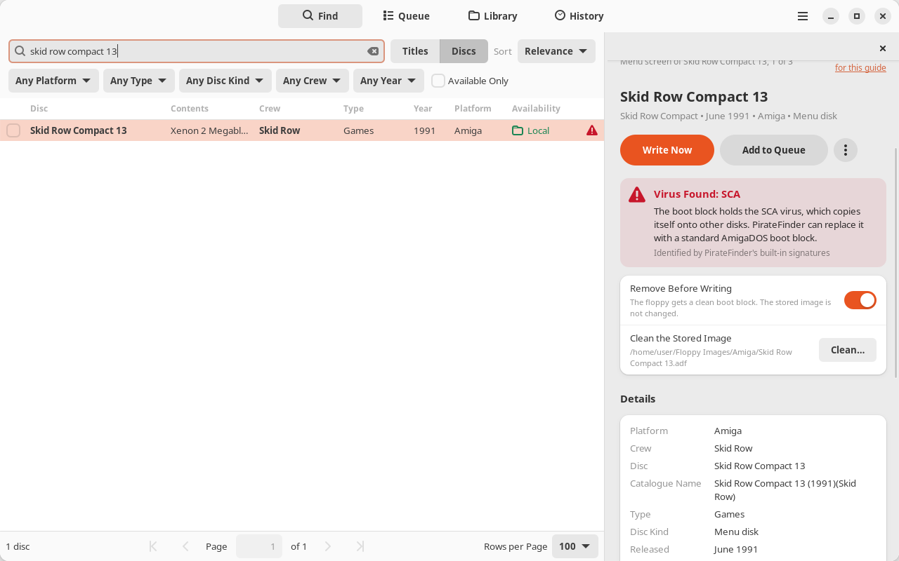

### Why it matters

Many disks of the time carried viruses. A floppy written from an infected image passes the virus on to the machine it starts and to the disks used on it afterwards. PirateFinder checks the boot block of every image it scans and of every image it prepares for writing, and says what it found before anything is written.

### What is checked

| What | How |
| --- | --- |
| Amiga boot blocks | The first 1,024 bytes of the disk. A boot block with a wrong checksum never runs, and one that holds the standard install code of Kickstart 1.3 or 2.0 is clean. Anything else is looked up first in the Amiga Bootblock Reader brainfile, when you have downloaded it, which names viruses, anti-virus blocks, loaders and intros. A boot block it does not name, or every boot block without it, is compared with the virus data built into PirateFinder: 34 signatures, each a stretch of virus code that is the same in every copy, which recognise about 90 boot block viruses, then 25 checks from VirusX 4.0 and 58 from AntiCicloVir 2.4, each a value at a fixed place in the boot block. |
| Atari ST boot sectors | The ST runs the boot sector only when its 256 words add up to hexadecimal `1234`. Such a sector is compared with the signatures of 8 boot sector virus families built into PirateFinder, each a stretch of the virus code: Ghost, Signum/BPL, Kobold #2, Mad, OLI, C'T, Toubab and Blot/Swiss/FAT. A sector none of them matches that carries the marker one of 7 other viruses leaves on the disks it infects, and code of the kind boot viruses use, is reported as probably infected with that virus, and is not changed. Immunisers and TOS boot loaders are recognised and left alone. |
| Catalogue flags | TOSEC marks the dumps it knows to be infected, such as [v Saddam 1]. The flag is shown even when the boot block is clean, because most flagged Amiga dumps carry file or link viruses that live outside the boot block. |

TOSEC also marks dumps damaged by a virus, as [b virus damage], and dumps that carry an anti-virus boot block, such as [m The Medway Boys Protector IV]. Both show among the dump's flags in the Dumps list.

### Where warnings appear

A warning sign in the results marks a disc whose dump carries a virus, and the details pane shows a red card under the buttons that names it: Virus Found: SCA for a virus found in the boot block, or Dump Flagged with Saddam 1 for a TOSEC flag. The card explains the virus and says who identified it.

The sign and the card describe the dump that would be written. A disc with a clean dump in your library shows no warning, even when another dump of it is flagged.

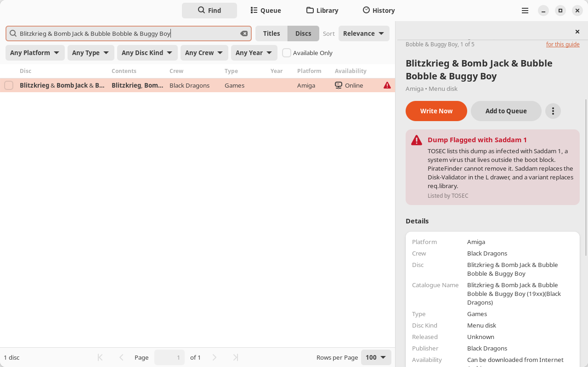

### Remove Before Writing

For a boot block virus that PirateFinder has identified, on a disk whose file system is intact, the card offers Remove Before Writing, which is on to start with. The floppy then gets a standard boot block: on the Amiga the one the Kickstart install command writes for the disk's file system, and on the Atari ST the same sector with its code cleared and made non-executable, keeping the disk's parameters. The image in your library is not changed. A note on the Queue page says so while the disc is written.

Any intro or loader that the virus replaced is gone with it; the disk then boots like a normally installed disk. Switch Remove Before Writing off to write the disk exactly as it is; the queue then says boot block virus left in place for that disc.

### Clean the Stored Image

When the infected dump is a file in your library, Clean the Stored Image removes the virus from the file itself, after asking. What happens depends on the file:

- An ADF, ST or MSA file is rewritten, and the original is kept beside it as name.bak, or name.2.bak when a backup is already there. A backup is never replaced.
- A DMS, ADZ, gzip or STX file is left as it is, and the cleaned disk is saved beside it as name (cleaned).adf or name (cleaned).st.
- An image inside a zip or 7z file is saved as a new file in your download folder, filed by platform, type and crew. The archive is not changed.

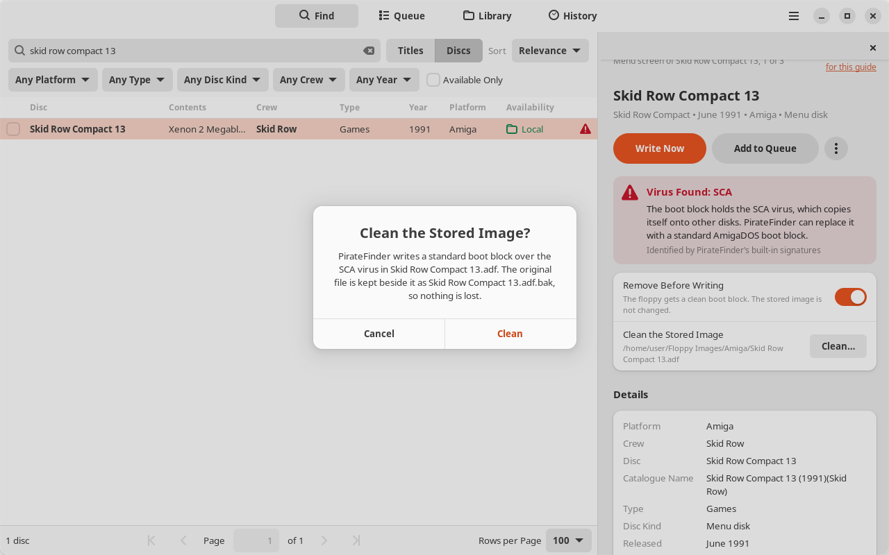

The cleaned file is added to the library at once and stays with its disc, although it no longer matches the catalogue checksum. The Library page has the same Clean button beside each virus that can be removed.

### Use Clean Dump

When the catalogue lists another dump of the same disc that no source flags with a virus, the card names it and offers Use Clean Dump, which chooses it in the Dumps list. The card then says The Clean Dump Will Be Written.

### File and link viruses

Viruses such as Saddam and BGS9 hide in the files on the disk or attach themselves to programs, rather than living in the boot block. PirateFinder cannot remove them and says so. Write a clean dump instead when there is one.

### The Amiga Bootblock Reader brainfile

Amiga Bootblock Reader, by Jason and Jordan Smith, keeps a brainfile that names thousands of Amiga boot blocks. It has no licence that allows it to be shipped with PirateFinder, so it is not included. In Preferences, on the Catalogue page under Virus Detection, Download Brainfile fetches the latest release from the project's GitHub page into your data folder, as WinUAE does. Update Brainfile fetches a newer release later.

Without the brainfile, Amiga boot blocks are compared with the standard boot blocks and the virus data built into PirateFinder. The brainfile names many more boot blocks, including loaders, intros and anti-virus blocks, and is asked first once it is installed. Installing or updating it makes PirateFinder check the boot blocks of your library again at once; see When the virus data changes. Atari ST checks do not need it.

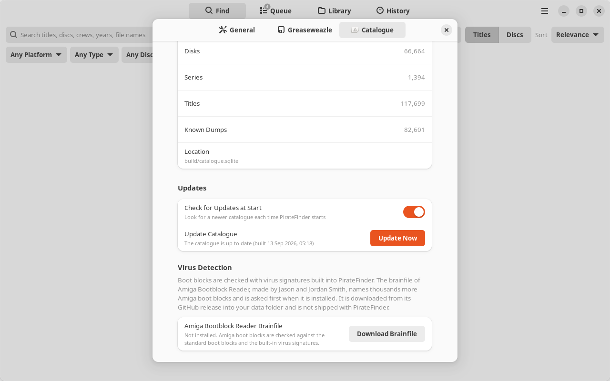

### When the virus data changes

The boot block of each library file is checked when the file is scanned, with the virus data PirateFinder has at the time. When that data changes, with a new version of PirateFinder or when the brainfile is installed or updated, PirateFinder checks the boot block of every library file again: when it starts, before the next scan, and straight after the brainfile is installed. The Library page shows the progress as Checking Boot Blocks, and a notification says how many files have a new result.

Only the boot block is read: the first kilobyte of an ADF or ST file, or what a packed image or an archive member unpacks to. Nothing is matched again, so the check is much quicker than a scan. A file that cannot be read at the time, such as one on a NAS that is not mounted, keeps its result and is read in full by the next scan.

### Boot code PirateFinder cannot identify

Many games and crews booted their own code: loaders, intros and copy protection. Boot code that PirateFinder cannot identify is therefore not treated as a virus, shows no warning and is never changed. When TOSEC flags such a dump, the card says that the boot block holds code PirateFinder cannot identify, which may be the virus. Only viruses PirateFinder identifies are removed, because replacing a loader would stop the disk from starting.

Such boot code, and anti-virus and loader boot blocks, are shown as Boot Block in the Details card of the details pane, as plain information.

## Library and Network Folders

Tell PirateFinder where your disk images are, and how it matches them to the catalogue.

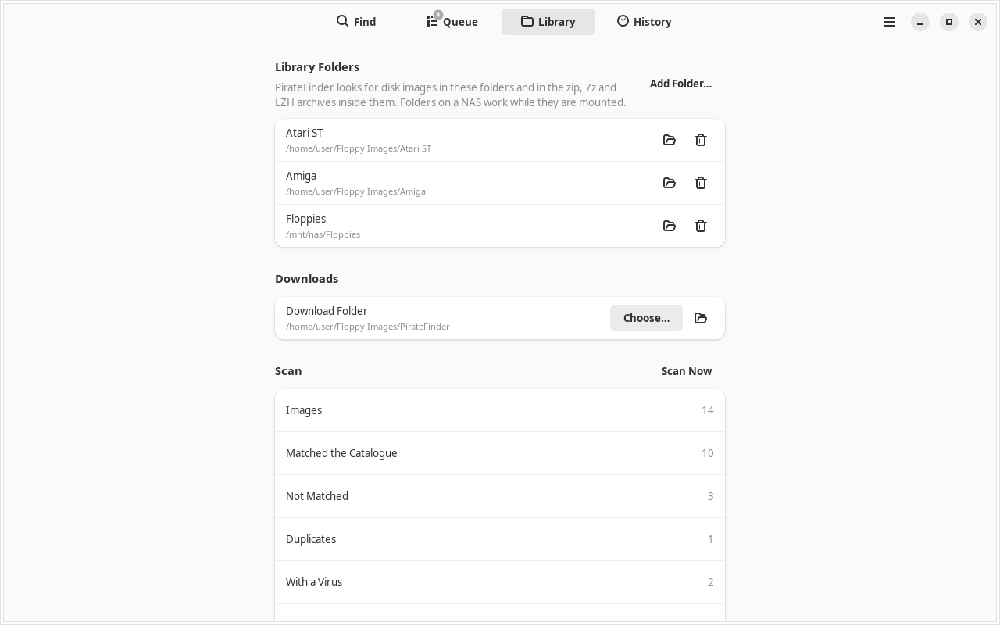

### Library folders

Add the folders that hold your disk images with Add Folder on the Library page. Adding or removing a folder starts a scan. Removing a folder only stops PirateFinder looking there; the files are not touched. The buttons beside each folder open it in Files or remove it.

### Folders on a NAS

A folder on a NAS works like any other while it is mounted. Connect to the share in Files, under Other Locations, for example `smb://nas/floppies`, and add the folder that appears under `/run/user/1000/gvfs/`. Or mount the share permanently through `/etc/fstab` and add the mount point, which is faster for a large collection and does not depend on Files.

### Scanning

Scan Now on the Library page, or Scan Library in the main menu, looks through every library folder and the download folder. Only files that are new, or whose size or date has changed since the last scan, are read, so a rescan of a large share is quick. Hidden folders, and the folders a NAS keeps for itself such as @eaDir, #recycle and #snapshot, are skipped. The button beside the progress bar stops a scan.

The first scan after updating to a version of PirateFinder that checks boot blocks reads every file once, which takes a while on a large network library. When only the virus data changes, the boot blocks are checked again without a full scan; see When the virus data changes, under Viruses.

### Archives

PirateFinder looks inside zip, 7z, gzip and LZH files as well as plain images, and follows one level of nesting, such as a 7z file holding one zip for each disk. Reading 7z and LZH files needs the `7z` command from the 7zip package, which the PirateFinder package recommends and apt installs by default.

### How files are matched

An image is recognised by its checksum, not by its name. MSA, DMS, ADZ and unprotected STX images are first decoded to the raw sectors that TOSEC lists checksums for, so an MSA file matches the TOSEC entry for the same ST disk whatever it is called. Atari Legend lists the checksums of its MSA files as they are stored, so those are tried as well.

An image that differs by a single byte from every known dump does not match, for example a disk that a game saved its high scores to.

### The counts

| Count | Meaning |
| --- | --- |
| Images | Disk images found, including those inside archives. |
| Matched the Catalogue | Images that match a known dump. |
| Not Matched | Images that match no disc. |
| Duplicates | Further copies of an image already counted. |
| With a Virus | Images whose boot block held a virus when it was last checked. |
| Last Scan | When the library was last scanned. |

### Viruses Found

When a scan, or a check after the virus data changed, finds boot block viruses, Viruses Found lists up to 50 of those files, with the virus, where the file is and whether the virus can be removed. Clean removes one that can be removed, after asking, and keeps the original; see Viruses.

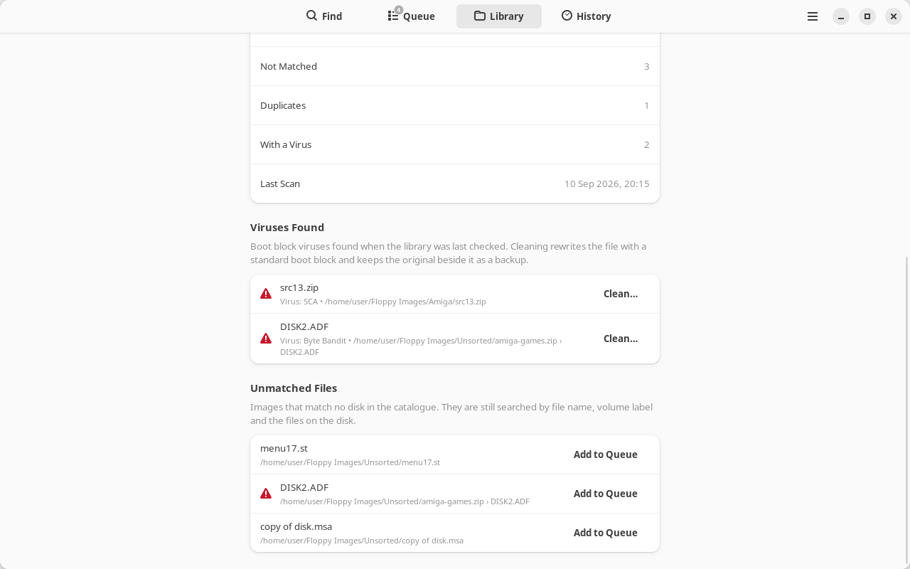

### Unmatched files

Unmatched Files lists up to 200 images that match no catalogue disc, and says how many there are when there are more. They can still be found on the Find page by file name, volume label and the names of the files on the disk, which are read from Atari TOS and AmigaDOS directories. Each one can be added to the queue and written like any other disc.

### What PirateFinder writes to your folders

PirateFinder reads library folders and does not change them, with one exception: Clean the Stored Image rewrites or adds a file after you confirm it. Downloads go only to the download folder.

## Downloads

When discs are downloaded, from where, how they are checked and where they are kept.

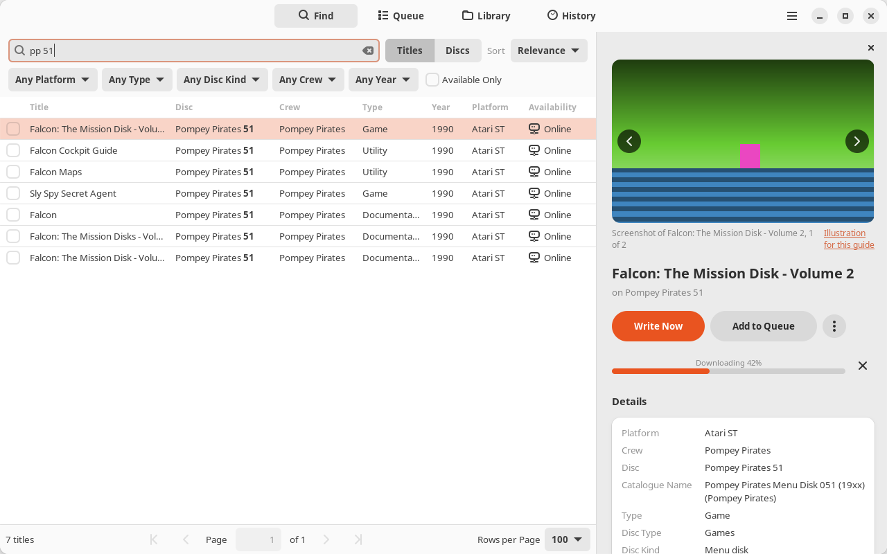

### When PirateFinder downloads

Nothing is downloaded until you ask for a disc that is not in your library: by writing it, by writing a queue that holds it, or with Download Only in the details pane. During a session the next disc is fetched in the background while the current one is written.

### Providers

The catalogue lists where each dump can be downloaded from:

| Provider | Hosts |
| --- | --- |
| Internet Archive | TOSEC-named Atari ST and Amiga images, including single disks taken from inside large zip and 7z sets, and the Vectronix disks from the LZH files on the Vectronix CD. |
| Atari Legend | MSA dumps of Atari ST menu disks. |
| D-Bug search engine | MSA files of D-Bug's own menus. |
| exxos Atari pages | The Persistence of Vision demo compilation disks. |
| amigascne archive | Amiga pack disks: game compacts and demo, music and tool packs, downloaded from its mirror on ftp.scene.org. |
| scene.org | Amiga packs Demozoo names on the main scene.org archive. |
| Fujiology | Atari ST packs and a few menus Demozoo names on fujiology.org, only files the size of a disk image. |

Each provider has a switch in Preferences, and Online Downloads switches them all off at once. With online downloads off, only your library is used, and discs that are not in it show as Missing.

### Checks

A download is taken out of its zip, 7z or LZH file and compared with the checksum in the catalogue before it is kept. An image that does not match is deleted, and the next provider is tried.

Some sources, such as the D-Bug and crew list MSA files, publish images without a checksum of their own. Such a download is kept when it is a copy of any dump the catalogue lists for the disc, compared the way the library matches your files, and it is saved under that dump's name. A note says which dump it matched. When it matches none of them it is deleted, and the next provider is tried. Only when the catalogue knows no checksum for any dump of the disc is the download kept unchecked, and while the disc is written a note on the Queue page says so. The library keeps such a download with its disc, so the disc shows as in your library, for as long as the file is unchanged.

PirateFinder names itself to every server, sends at most one request a second to each server, waits when a server asks it to, and resumes a download that was interrupted.

### The download folder

Downloads are kept for archiving, in folders by platform, type and crew, as `platform/type/crew/file` inside the download folder. For example:

- `Atari ST/Games/Automation/Automation Menu Disk 250 (1990)(Automation).st`
- `Atari ST/Games/Empire/Speedball 2 - Brutal Deluxe (1990)(Image Works)[cr Empire][t].st`
- `Amiga/Games/Skid Row/Compact #128 (1992)(Skid Row).adf`
- `Amiga/Demos/Effect/Effect-PrevailPack147.adf`

The platform is Amiga or Atari ST. The type is Games, Applications, Demos or Music, from what is on the disc: games, trainers, cheats and documents make Games, utilities make Applications, demos and intros make Demos, and music makes Music. Intros, documents and cheats count only when the disc holds nothing else. The crew is the crew behind the series, such as Skid Row for the Skid Row compacts, or for a single disc the crew that cracked it, or its publisher. The file keeps the catalogue's name for the dump.

The download folder is Floppy Images/PirateFinder in your home folder to start with. Change it on the Library page or in Preferences, for example to a folder on a NAS. It is scanned with the library folders, so a downloaded disc shows as Local from then on.

### Switching downloads off

Switch off a provider to stop using it, or Online Downloads to stop every disk image, picture and summary download. The catalogue update check has a switch of its own, Check for Updates at Start. Privacy lists every request PirateFinder makes.

### Copyright

The disks in the catalogue contain copyrighted software. PirateFinder hosts no disk images. It downloads an image only when you ask for it, from third-party archives that it does not run. You are responsible for complying with the law where you live.

## Preferences

Every setting, where to find it and what it does.

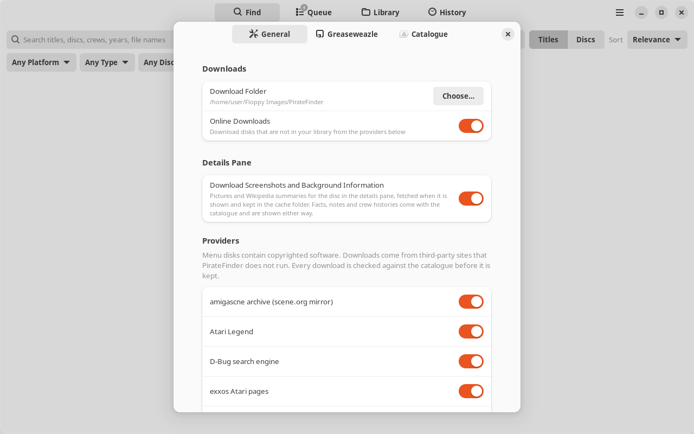

### Opening Preferences

Choose Preferences in the main menu, or press Ctrl+Comma. Every change is saved as soon as it is made. The drive and the download folder can also be set on the Queue and Library pages.

### General

| Setting | What it does |
| --- | --- |
| Download Folder | Where downloaded images are kept. Floppy Images/PirateFinder in your home folder to start with. |
| Online Downloads | Allows downloads from the providers below. On to start with. When off, no disk image, picture or summary is downloaded. |
| Download Screenshots and Background Information | Fetches pictures and Wikipedia summaries for the disc in the details pane, when it is shown. On to start with. Greyed out while Online Downloads is off. |
| Download All Pictures | Fetches every picture the catalogue lists for the platforms you choose, ahead of time, into the details pane's cache. Only while both switches above are on. |
| Providers | One switch for each provider the catalogue lists, all on to start with. |

### Greaseweazle

| Setting | What it does |
| --- | --- |
| Drive | A, B or 0 to 3; see Writing Disks. A to start with. |
| Device | The serial port of the Greaseweazle, such as `/dev/ttyACM0`, used for writing and for the connection check, and the port PirateFinder watches for. Leave it empty, the usual choice, to let `gw` find the device. |
| Retries | How many times a track that fails to verify is written again, from 0 to 10. 3 to start with. |
| Erase Before Writing | Wipes each track before writing it. Slower, and helps with old floppies. Off to start with. |
| Ask Before Each Disk | Asks for a floppy before every disc. When off, only the first disc of a session is asked for. On to start with. |
| Connection | The Greaseweazle found, with its model, port, firmware and host tool version, and a newer firmware when the host tool reports one, which it can only while Online Downloads is on. Check Connection asks the host tool again. |
| IPF Support | Whether the SPS Decoder Library, which Greaseweazle needs to write IPF images, is found on this computer, installed by PirateFinder, or not installed. Install shows its licence and downloads it once you accept; Remove deletes the copy PirateFinder installed. See Image Formats and Conversions. |

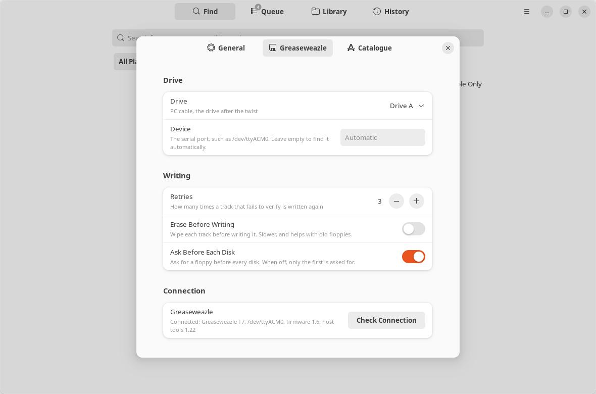

### Catalogue

| Setting | What it does |
| --- | --- |
| Installed Catalogue | When the catalogue was built, how many disks, series, titles and known dumps it holds, and the file in use. |
| Check for Updates at Start | Looks for a newer catalogue each time PirateFinder starts. On to start with. |
| Update Catalogue | Update Now looks for a newer catalogue. Install downloads and installs one that was found, after asking. |
| Virus Detection | The version of the Amiga Bootblock Reader brainfile and how many boot blocks it names, with Download Brainfile or Update Brainfile. |

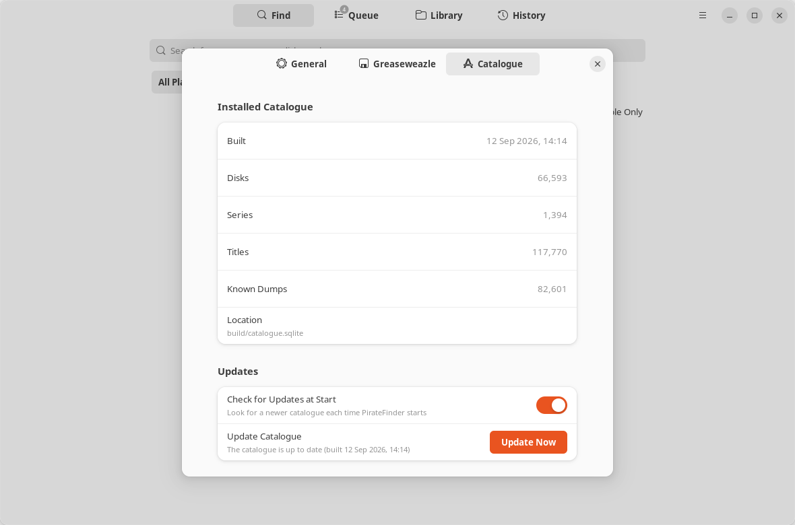

### The settings file

Settings are kept in `~/.config/piratefinder/settings.json`, which only you can read. If the file cannot be read, it is copied to settings.json.bak and the defaults are used.

## Updating the Catalogue

What the catalogue holds, how a newer one is installed, and how to build one yourself.

### What is in it

The catalogue lists menu disks, compacts, packs, compilations and single cracks for the Atari ST and the Amiga: what is on each disc, every known dump with its checksums and TOSEC flags, and where a dump can be downloaded. For the details pane it holds the addresses of pictures, facts and notes, Wikipedia article titles and crew histories. It is built from public sources, listed in Data Sources and Credits. PirateFinder only reads it and never changes it.

The Find page and Preferences show how many discs, series, titles and known dumps the installed catalogue holds, and when it was built.

### How updates work

A new catalogue is built each week and published as a release of the PirateFinder project on GitHub: a compressed file with its SHA-256 checksum beside it, named by the layout it holds, such as catalogue-layout3.sqlite.gz. The releases are public. With Check for Updates at Start on, PirateFinder looks for one each time it starts and offers it in a notification with an Update button. Update Catalogue in the main menu, or Update Now in Preferences, looks at any time. Only catalogues of the layout this version reads are offered.

When the check cannot reach GitHub or read its answer, Preferences says Could not check for a newer catalogue, with the reason, such as no network or GitHub limiting requests. The catalogue is up to date is said only when the check worked and found nothing newer.

Installing downloads the file, checks it against the published checksum, decompresses it, and checks that this version of PirateFinder can read it before it is put in place, so a failed or cancelled update leaves the old catalogue in use. Your library, queue and history are kept, and your files are matched against the new catalogue straight away. While discs are being written an update cannot be installed; install it when the session is over.

### Which catalogue is used

PirateFinder uses the newest of up to three copies: one installed by an update, in `~/.local/share/piratefinder`, the one in the package, in `/usr/share/piratefinder`, and, when run from a source tree, `build/catalogue.sqlite`. A copy made for another version of PirateFinder is passed over. Setting the environment variable `PIRATEFINDER_CATALOGUE` to a file makes PirateFinder use that file instead. Preferences shows the file in use.

### No catalogue

Without a catalogue it can read, the Find page says No Catalogue Installed and offers Update Catalogue. Preferences, on the Catalogue page, says why the catalogue could not be opened.

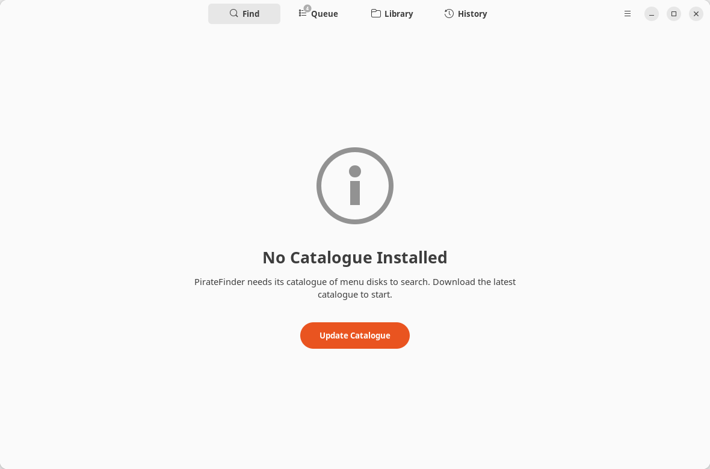

### Building the catalogue yourself

The catalogue builder is part of the source tree and needs only Python 3.12. Run `PYTHONPATH=src:. python3 -m catalogue_builder` in the source tree. It downloads its sources into a cache, joins them and writes `build/catalogue.sqlite`, which PirateFinder uses when it runs from the same tree. The first build downloads the TOSEC DAT pack and the other sources' dumps; later builds reuse the cache. docs/CATALOGUE.md in the source tree explains the options.

## Updating PirateFinder

Checking for a newer version of PirateFinder from the About window, and installing it.

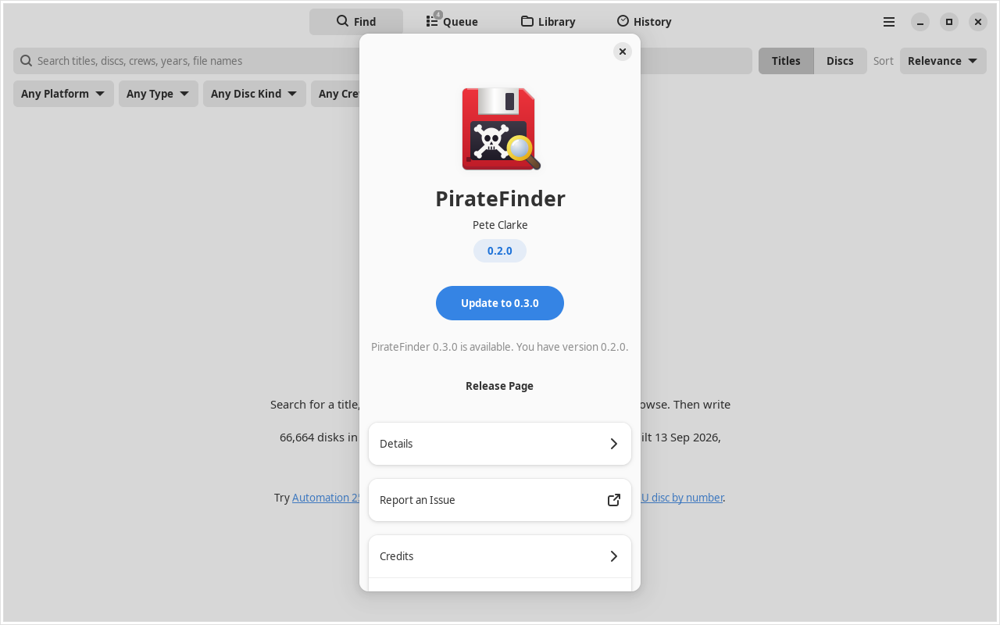

### Checking for a newer version

Open About PirateFinder from the main menu and press Check for Application Updates. PirateFinder asks GitHub for the newest release of the application and compares it with the version shown above the button. It checks only when you press the button; nothing is sent when PirateFinder starts.

The answer shows under the button: that this is the newest version, or the newer version and the one you have. When GitHub cannot be reached or its answer cannot be read, it says Could not check for a newer version, with the reason, and never that this is the newest version.

### Installing it

1. Press Update to, followed by the new version number. A question says which package will be installed and shows the release notes.
2. Press Download and Install. The package made for your system, such as Ubuntu 24.04 on amd64, is downloaded from GitHub and checked against the SHA256SUMS file published with it. A package that does not match is deleted and nothing is installed.
3. The system asks for your password, and apt installs the package over the old one. Your settings, library, queue, history and downloaded images are kept.
4. Press Restart PirateFinder, or Restart in the notification, to start the new version.

### While it runs

Closing the About window does not stop a download, and reopening it shows how far it has got. Cancel stops the download. Installing waits for as long as the password prompt is open; once you answer it, apt runs to the end and cannot be cancelled. While discs are being written, an update cannot be installed and PirateFinder cannot restart; wait until the session is over.

### When it cannot install

- Dismissing the password prompt installs nothing and leaves the update offered.
- Without pkexec, or when the system does not allow the installation, the message gives a command to run in a terminal instead: sudo apt install followed by the downloaded package, which is kept in `~/.cache/piratefinder/updates`.
- A copy run from its source tree cannot update itself. The button then opens the release page; update the source tree instead.
- When the release has no package for your system, the button opens the release page, which lists the packages it has.

### The catalogue

The catalogue is updated on its own, with Update Catalogue in the main menu, as Updating the Catalogue describes. Each new version of PirateFinder brings the newest catalogue with it.

## Image Formats and Conversions

Which image files can be written, and how each one is prepared.

### Preparing an image

Before each write PirateFinder prepares the image: a container is decoded to raw sectors, the layout of the disk is worked out, and a copy that Greaseweazle accepts is written to a temporary folder. Your own files are not changed. A note describes each conversion made, such as Unpacked the MSA archive to a plain sector image, on the Queue page while the disc is written and in the summary, the history and the report. An image that cannot be written faithfully is refused with the reason, and PirateFinder tries the next image of the disc.

### Formats

| Format | Written as |
| --- | --- |
| `.adf` | Amiga, written as it is: double density, or high density for a 1.76 MB image. An ADF with 81 to 84 cylinders is written with all of them; a shorter one is padded to 80 cylinders, with a note saying so. Extended ADF, which holds raw tracks of protected disks, is refused. |
| `.dms` | Decoded to ADF, checking every track's checksum, then written as an ADF. |
| `.adz`, `.gz` | Decompressed, then written as what is inside. |
| `.st` | The layout comes from the boot sector and is checked against the file size. The standard 80-cylinder layouts use Greaseweazle's own formats; any other, such as 82 or 83 cylinders or 11 sectors a track, gets a disk definition of its own so that no track is dropped. |
| `.msa` | Unpacked to ST, then written exactly as an ST. |
| `.stx` | Converted to ST when the Pasti image records no copy protection. A protected STX is refused, because a sector image cannot hold the protection and Greaseweazle cannot write STX files. |
| `.ipf` | Written directly when Greaseweazle can use the SPS Decoder Library, and refused otherwise. See IPF images, below. |
| `.scp`, `.hfe` | Written directly as flux. Greaseweazle cannot verify a flux write, so these discs are reported as Written, not verified. |
| `.zip`, `.7z`, `.lzh` | The disk image inside is read, then handled as above. |

### IPF images

Greaseweazle reads IPF images with the SPS Decoder Library (CAPSImg) of the Software Preservation Society. Its licence allows only non-commercial use, so it does not come with PirateFinder, and until it is installed an IPF image is refused with a message that says so.

PirateFinder can install the build made for the FS-UAE emulator. It is downloaded from fs-uae.net only after you accept the licence, checked against the checksum PirateFinder knows, and installed for your account in `~/.local/share/piratefinder/caps`. Cancel stops the download, and Remove deletes the library again.

There are builds for 64-bit PCs and for 32-bit Arm systems, such as a Raspberry Pi running a 32-bit system, but none for 64-bit Arm; IPF Support says when there is no build for your computer. A copy installed another way, such as one built from the SPS source, is used when the system finds it; IPF Support then says Found on this computer and offers no download.

To install it:

1. Open Preferences and choose the Greaseweazle page.
2. Under IPF Support, choose Install.
3. Read the licence, then choose Accept and Install.

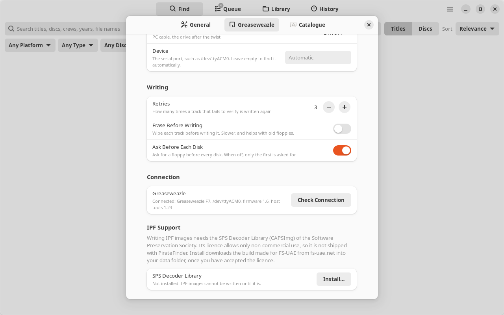

### Extra cylinders

Many menu disks were formatted with 82 or more cylinders to fit more on them. Greaseweazle writes only the cylinders its format names, so writing an 82-cylinder ST image with the standard 80-cylinder format would lose the last two without a word. PirateFinder gives such an image a disk definition with its real cylinder count and Greaseweazle's own track settings, so that only the length differs. Layouts beyond 86 cylinders are refused.

When the boot sector of an ST image does not describe the disk, the layout is taken from the file size, with a note saying so.

### When the platform disagrees

When the catalogue's platform for a disc and the image disagree, the image is believed, with a note saying so.

## Troubleshooting

No Greaseweazle, write-protected floppies, the wrong drive, failed tracks, catalogue and download problems.

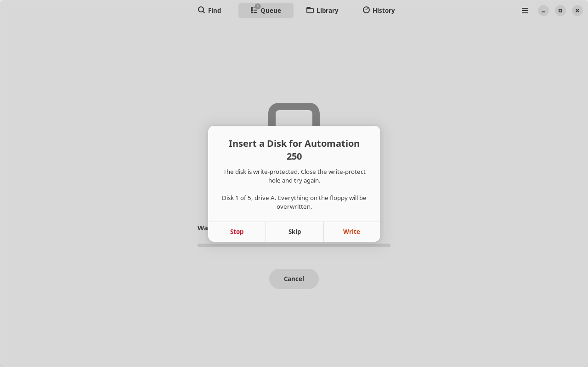

### The Greaseweazle is not found

- Check the USB cable and try another port. The bar under the header offers Retry, and Check Connection in Preferences shows the message the host tool gave. Both ask the host tool directly, so they find a Greaseweazle that the regular check of the device list misses; setting Device in Preferences to its port also helps then.
- After installing the package, unplug the Greaseweazle and plug it in again, so the device rule that gives you access applies.
- When running from source, install the udev rules that come with the Greaseweazle host tools, or add your account to the dialout group and log in again.
- Close any other program that is using the Greaseweazle, such as Greaseweazle-GUI during a read or write. Both can be installed together, but only one can talk to the device at a time.
- The Diagnostic Log in the main menu shows what `gw` printed.

### The disk is write-protected

A 3.5 inch floppy can only be written when its write-protect tab covers the hole. Slide the tab so the hole is closed, insert the disk again and choose Write; the prompt comes back by itself.

### No index, or no disk found

Greaseweazle reports No Index when the drive is not turning a disk, and Track 0 not found when the head cannot find the first track. PirateFinder reports either one as No disk in the drive and asks for the floppy again. Check that the disk is fully inserted, that the drive has power, that the ribbon cable is the right way round, and that the drive choice matches the cable.

### The wrong drive is selected

When the drive choice does not match the cable, the Greaseweazle talks to a drive that is not there: the light on your drive stays off, and the write stops with no index. With a PC floppy cable that has a twist, choose A for the drive after the twist, at the end of the cable, and B for the drive before it. With a straight cable, choose 0 to 3 to match the drive's select jumper. The drive is set on the Queue page and in Preferences.

### Tracks that do not verify

A track that still fails after the retries usually means a worn floppy or dirty drive heads. Try another floppy first, then clean the heads. High-density floppies (1.44 MB, with a second hole) are less reliable when written as double-density disks; use double-density floppies where you can. Erase Before Writing and more Retries, in Preferences, can help with old floppies. The summary lists the tracks that failed.

### IPF images are refused

Writing an IPF image needs the SPS Decoder Library, which is not installed: install it with IPF Support in Preferences, on the Greaseweazle page, as Image Formats and Conversions describes. When the message says PirateFinder has no build for this computer's processor, as on a 64-bit Arm system, install the library another way, such as by building it from the SPS source, or write another dump of the disc.

When the install fails, IPF Support says why. A file that does not match the checksum PirateFinder knows, or a library that does not load on this computer, is never installed.

### A catalogue from another version

A catalogue built for an older or newer PirateFinder has a different layout and cannot be read. PirateFinder then uses another copy it can read, or shows No Catalogue Installed; Preferences says the file was made for a different PirateFinder version, with its layout and the one this version reads. Install the current package, or build a catalogue from the same source tree. If `PIRATEFINDER_CATALOGUE` is set, check that it names a current file.

### Check for Application Updates cannot check or install

Could not check for a newer version, followed by a reason, means GitHub could not be reached or its answer could not be read; try again later. The update failed, followed by a reason, comes from the download or from apt, and gives the command to install the downloaded package in a terminal. Updating PirateFinder has the details.

### Update Catalogue cannot check

Could not check for a newer catalogue, followed by a reason, means the list of releases on GitHub could not be fetched or read: no network, or GitHub limiting requests from your address, which it does after 60 an hour without an account. Try again later. The installed catalogue stays in use.

### Downloads fail

- Check that Online Downloads and the provider are switched on in Preferences, and that the provider's site opens in a web browser.
- A download that does not match the catalogue checksum is deleted and the next provider is tried. When none works, the disc is reported as No usable image, and the Diagnostic Log has each provider's reason.
- A busy server is asked again after a pause. One that asks for a long wait is treated as unavailable for now; try again later.

### Pictures do not appear

Check that Download Screenshots and Background Information and Online Downloads are on in Preferences. The Picture Is Not Available means the site said it does not have the picture. A busy site sometimes says so of pictures it has, so PirateFinder asks again an hour later, and only after two such answers in a row leaves the picture for seven days.

### The first scan is slow

The first scan of a folder reads every file, and so does the first scan after updating to a version that checks boot blocks. Later scans read only new and changed files.

### Diagnostic Log

The Diagnostic Log in the main menu shows recent Greaseweazle output and messages from searches, scans, downloads and sessions. Copy it or save it to a file when asking for help, and remove private paths first. It is kept in memory only, never holds disk contents, and is cleared when PirateFinder closes.

## Keyboard Shortcuts

Keys for searching, moving between pages and acting on results.

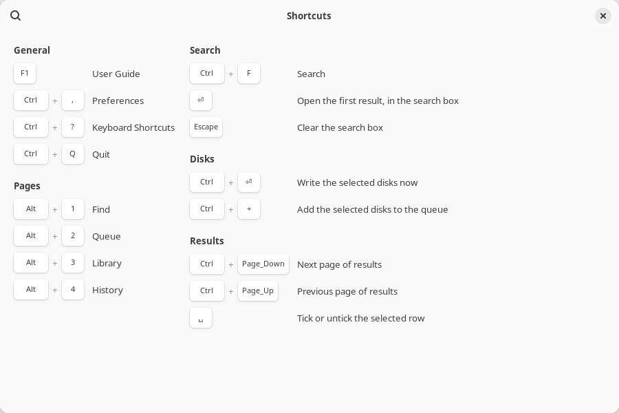

### General

| Keys | Action |
| --- | --- |
| F1 | User Guide |
| Ctrl+Comma | Preferences |
| Ctrl+? | Keyboard Shortcuts |
| Ctrl+Q | Quit |

### Pages

| Keys | Action |
| --- | --- |
| Alt+1 | Find |
| Alt+2 | Queue |
| Alt+3 | Library |
| Alt+4 | History |

### Search

| Keys | Action |
| --- | --- |
| Ctrl+F | Search |
| Enter | Open the first result, in the search box |
| Escape | Clear the search box |

### Disks

| Keys | Action |
| --- | --- |
| Ctrl+Enter | Write the selected disks now |
| Ctrl+Plus | Add the selected disks to the queue |

### Results

| Keys | Action |
| --- | --- |
| Ctrl+Page Down | Next page of results |
| Ctrl+Page Up | Previous page of results |
| Space | Tick or untick the selected row |

### Other keys

Tab moves between the controls, and the arrow keys move through the results and lists. In the table, Enter opens the details of the selected row. Ctrl+Plus and Ctrl+Enter act on the ticked rows, or on the disc in the details pane when nothing is ticked. Ctrl+= does the same as Ctrl+Plus.

Ctrl+? opens the Keyboard Shortcuts window, which lists the same keys.

## Data Sources and Credits

Where the catalogue, the pictures and the background information come from, and their licences.

### The catalogue

The catalogue is built from the public sources below. As a whole it is licensed under CC BY-NC-SA 4.0, because it includes Atari Legend data under that licence: it may be shared and adapted for non-commercial purposes, with credit and under the same licence. The PirateFinder program is licensed under GPL-3.0-or-later.

| Source | What it gives, and its terms |
| --- | --- |
| TOSEC | Disc names, sizes, checksums and flags of Atari ST and Amiga dumps, from the TOSEC DAT pack (tosecdev.org). The DAT files are freely distributable; no licence is stated. |
| Atari Legend | Contents, conditions, release dates, notes and menu screenshots of about 6,900 Atari ST menu disks, facts about the games on them and crew histories, from its weekly database export (atarilegend.com). CC BY-NC-SA 4.0. |
| D-Bug | Contents and credits of Automation 0 to 512 and D-Bug 1 to 200, and the menu screenshots of the D-Bug archive (d-bug.me), screenshots by Mr. Sam. No licence is stated; used for reference, with credit. |
| Demozoo | Pack and menu contents, release dates, notes, screenshots and crew histories, from its daily database export (demozoo.org). No licence is stated; every picture and note is credited to Demozoo and links to its page. |
| libretro-thumbnails | Snaps, title screens and box art of single games (github.com/libretro-thumbnails). The repositories carry no licence file; every picture is credited. |
| Wikidata | Which English Wikipedia article belongs to a game (wikidata.org). CC0. |
| Wikipedia | Summaries of articles about games, discs and crews, fetched when shown (en.wikipedia.org). CC BY-SA 4.0, credited with a link to the article. |
| Internet Archive | Download locations of TOSEC-named images (archive.org). Items are uploaded by third parties, and the Internet Archive's terms apply. |
| Pompey Pirates CD-R | The crews' own lists of the Pompey Pirates, Medway Boys, Flame of Finland, Superior, Cynix and Delight menus, from the CD-R compiled in 1997 by Alien of the Pompey Pirates and kept on the Internet Archive. |
| Steem | A cross-check of Automation contents and part numbering, from Chris Edgar's 2002 test of every Automation disk in the Steem emulator. |
| 8bitchip | A game to disk index covering Vectronix, SuperGAU, Fuzion and the doc disks (atari.8bitchip.info). |
| exxos | Contents and downloads of the Persistence of Vision disks (exxosforum.co.uk). |
| amigascne | Download locations and checksums of about 11,000 Amiga pack disks, and the texts of their menus, from the archive's mirror at scene.org (ftp.scene.org/mirrors/amigascne). No licence is stated; used with credit. |

### Sites not used

Janeway, the English Amiga Board and Hall of Light are good references, but they ask automated clients not to fetch from them, so the catalogue builder does not.

### Software

| Project | What PirateFinder uses |
| --- | --- |
| Greaseweazle | The hardware, and the host tools PirateFinder runs to write, by Keir Fraser (github.com/keirf/greaseweazle). The package includes host tools 1.23, released under the Unlicense. |
| Amiga Bootblock Reader | The brainfile that names Amiga boot blocks, by Jason and Jordan Smith. It is downloaded only when you ask, and is not shipped because it has no licence. |
| SPS Decoder Library | The CAPSImg library Greaseweazle uses to read IPF images, by Istvan Fabian for the Software Preservation Society, in the build Frode Solheim makes for FS-UAE (fs-uae.net). Its licence allows only non-commercial use, so it is not shipped; IPF Support in Preferences shows the licence and downloads it when you accept. |
| xDMS | The DMS decoder is a port of xDMS 1.3 by Andre Rodrigues de la Rocha, which its author placed in the public domain. |
| File Forges | The MSA, STX, DMS and disk layout code comes from the Atari File Forge and Amiga File Forge projects, under the MIT licence. |

### Virus data

The virus data built into PirateFinder holds facts about viruses, never their code: checksums of stretches of virus code, and values found at fixed places in a boot block.

The Atari ST signatures come from the reference sectors of the freeware anti-virus programs The Killer 2.0 and Xtermine 0.2 (The Exorcist), and from boot sectors kept with published ST sources. The markers of seven ST viruses are the numbers in appendix A of the Ultimate Virus Killer book by Richard Karsmakers; only the numbers are used, and the book's text is not reproduced.

The Amiga signatures were derived by PirateFinder from samples of the viruses. The Amiga checks come from VirusX 4.0 by Steve Tibbett and Dan James, and from AntiCicloVir 2.4 by Matthias Gutt, which its author placed in the public domain.

The list of where well-known Amiga viruses live (in the boot block, in programs or in system files) comes from the Virus Help Team's Amiga Virus Encyclopedia.

### In the application

About PirateFinder, in the main menu, lists the catalogue sources with links to them, Greaseweazle, the works the virus data comes from and the Amiga Bootblock Reader, whose brainfile is downloaded only when you ask. Every picture, fact and summary in the details pane names its source.

## Privacy

Every network request PirateFinder makes, and everything it stores on your computer.

### Network requests

PirateFinder has no account, sends no usage statistics and has no crash reporting. Searches run on the catalogue on your computer, and your library and history never leave it. It makes these requests, and no others:

| When | What is requested |
| --- | --- |
| When PirateFinder starts | With Check for Updates at Start on, one request to api.github.com for the PirateFinder release list, to see whether a newer catalogue is published. |
| When you install a catalogue update | The catalogue file for this version's layout and its checksum, from github.com. |
| When you press Check for Application Updates | One request to api.github.com for the latest PirateFinder release. |
| When you install a new version of PirateFinder | The package for your system and the release's SHA256SUMS file, from github.com. |
| When you write or download a disc that is not in your library | The disk image, from the provider the catalogue names for it. During a session the next disc is fetched in the background. |
| When the details pane shows a disc | With Download Screenshots and Background Information and Online Downloads on: each picture as it is shown, from the site that hosts it (atarilegend.com, d-bug.me, media.demozoo.org, or raw.githubusercontent.com for libretro-thumbnails), and the Wikipedia summaries of the title, the disc and the crew, from en.wikipedia.org. |
| When you choose Download under Download All Pictures | Every picture the catalogue lists for the platforms you chose that is not on this computer yet, one a second from each of the same sites. |
| When you choose Download Brainfile | The latest Amiga Bootblock Reader release, from api.github.com and github.com. |
| When you accept the licence under IPF Support | The SPS Decoder Library for your processor, from fs-uae.net. |
| When a Greaseweazle is plugged in, or you choose Retry or Check Connection | PirateFinder runs the host tool's `gw info` command to identify the device, and `gw info` asks api.github.com for the newest Greaseweazle firmware version. This request comes from the Greaseweazle host tools, not from PirateFinder's own code. While Online Downloads is off, PirateFinder keeps it from leaving the computer, and newer firmware is not reported. The regular check for the device reads the computer's device list only, and nothing runs while a disc is being written. |

Every request from PirateFinder names it, its version and the project page in the User-Agent header. A picture or summary request tells that site which title you are looking at, as visiting its page would.

### Turning requests off

Online Downloads off stops disk image, picture and summary downloads. Download Screenshots and Background Information off stops pictures and summaries only, Download All Pictures included. Check for Updates at Start off stops the check at start. The brainfile and the SPS Decoder Library are fetched only when you ask for them. Online Downloads off also stops the Greaseweazle host tool's firmware check, which otherwise happens only when `gw info` identifies a Greaseweazle.

### What is stored

| What | Where |
| --- | --- |
| Settings | `~/.config/piratefinder/settings.json` |
| Library index, write history, corrections and cleaned files | `~/.local/share/piratefinder/user.sqlite` |
| The queue | `~/.local/share/piratefinder/queue.json` |
| A catalogue installed by an update | `~/.local/share/piratefinder/catalogue.sqlite` |
| The Amiga Bootblock Reader brainfile | `~/.local/share/piratefinder/virus/abr/` |
| The SPS Decoder Library, when installed with IPF Support | `~/.local/share/piratefinder/caps/` |
| Pictures and Wikipedia summaries | `~/.cache/piratefinder/media/`, kept for 30 days and then checked again. A picture a site says twice in a row it does not have is remembered for 7 days. |
| Downloads being checked | `~/.cache/piratefinder/downloads/`, removed after the check. |
| Downloaded disk images | The download folder, Floppy Images/PirateFinder in your home folder to start with. |
| Images prepared for writing | A temporary folder, removed when the disc is done. |
| The Diagnostic Log | Memory only, cleared when PirateFinder closes. |

The folders follow `XDG_CONFIG_HOME`, `XDG_DATA_HOME` and `XDG_CACHE_HOME` when those are set. Removing the package leaves all of them in place; delete them to remove everything PirateFinder stored. Deleting `~/.cache/piratefinder` is always safe.
